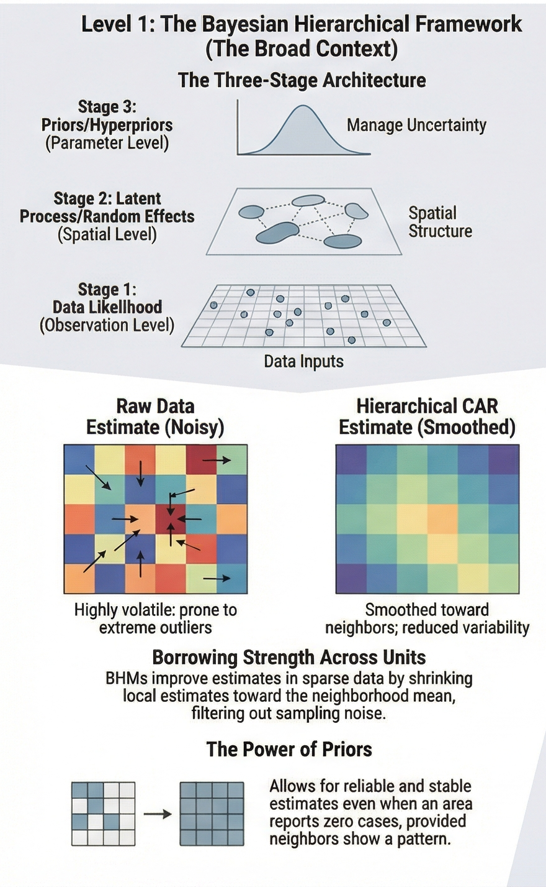

::: callout-warning
NO PDF: chromote–Chrome compatibility issue that appeared with newer Chrome builds (very similar errors were reported around Chrome v128+, breaking chrome_print() / chromote on multiple systems).

Brute force `quarto render Spatial_bayesian_models.qmd --to html`
:::

# Set-up

```{r}
#| label: timestamp-setup
#| echo: false

knitted_when <- format(Sys.Date())
knitted_where <- knitr::current_input()
knitted_with <- packageVersion("knitr")
knitted_doc_url <- downlit::autolink_url("knitr::knit()")
```

Note updated on `r knitted_when` from `r knitted_where` with knitr version `r knitted_with`.

::: {.callout-note collapse="true"}
## General set-up of the program.

These notes make use of the following R packages and general set-up.

```{r}
#| label: set-up

  if (!require("pacman")) {
  install.packages("pacman")
  }

  pacman::p_load(tidyverse 
                 ,tidylog
                 ,Cairo
                 ,here
                 ,dplyr
                 ,htmltools
                 ,SpatialEpi # for pennLC data
                 ,crsuggest  # Suggest CRS information for spatial data
                 ,ggplot2
                 ,ggnewscale # For multiple fill and colour scales in ggplot2
                 ,sf         # DONT'T FORGET uses the s2geometry library
                 ,leaflet    # JavaScript libraries for interactive maps
                 ,leafem     # Extensions for leaflet 
                 ,knitr
                 ,ragg       # Graphic devices based on the AGG library
                 ,downlit    # For syntax highlighting and automatic linking
                 ,git2r      # Provides access to 'Git' repositories
                 ,xfun       # For alternative Session Info
                 )
  
  #pacman::p_update()         # Update out-of-date packages

  options(scipen = 100, digits = 2)             # Prefer non-scientific notation
  
  knitr::opts_chunk$set( dev       = "ragg_png"
                        ,fig.path  = "Images/"
                        ,dpi       = 600
                        ,fig.width = 10
                        ,fig.hight = 12
  # Automatically formatting code using styler
                        ,tidy      = "styler"
)

```
:::

# Basic concepts

::: {.callout-note collapse="true"}
## Spatial autocorrelation

As data redundancy, as missing spatial variables, and as a map pattern are different ways of viewing spatial autocorrelation, and all mutually implicate one another (Griffith, 1992).
:::

::: {.callout-note collapse="true"}
## Spatial confounding

Following Hodges and Reich (2010), refers to the difference in estimates provided by spatial and nonspatial models, arising from correlation between covariates and the spatial trend, which can influence coefficient estimates (see critique in Donegan, 2024).
:::

::: {.callout-note collapse="true"}
## Exchangeability (spatial)

When researchers observe discrete heterogeneity across different groups or contexts—such as distinct geographical units, time periods, or demographic cohorts—but lack a canonical theoretical mechanism to logically order, arrange, or differentiate these contexts a priori, the latent parameters governing these contexts are assumed to be exchangeable (Betancourt).

Rather than estimating each parameter in complete isolation, the hierarchical architecture allows observations within one specific context to inform the overarching hyperparameters, which consequently regularise the parameter estimates of all other exchangeable contexts (Betancourt).
:::

::: {.callout-note collapse="true"}
## Prior distributions

Prior distributions place probabilities on parameter values before seeing the data; these beliefs are updated with observed data via Bayes’ rule to obtain posterior beliefs (e.g., Wagenmakers et al., 2018; Jeffreys, 1961).
:::

::: {.callout-note collapse="true"}
## Jeffreys–Lindley paradox

Wide priors that spread mass over many possible effect sizes can make any specific effect unlikely a priori, so evidence can increasingly favor the null hypothesis in model comparison even when a classical test rejects it.
:::

::: {.callout-note collapse="true"}
## Proper priors

A prior is proper if all probabilities are non‑negative and the distribution sums
(discrete) or integrates (continuous) to 1 (Veenman et al., 2023).
:::

::: {.callout-note collapse="true"}
## Conjugate priors

Conjugate priors are chosen so that the posterior distribution belongs to the same family as the prior, which often simplifies analytic or computational work (Fink, 1997a).
:::

# Types of Models

Following Cramb SM, Duncan EW, Baade PD, Mengersen KL, 2017. Investigation of Bayesian Spatial Models, two broad types of models were identified, namely "global" spatial smoothing models that have a common spatial smoothing term across the region, and "local" spatial smoothing models that allow for differential smoothing depending on neighbourhood characteristics.

The specific models that were identified in the literature are listed below.

-   Global spatial smoothing:
    -   Intrinsic CAR/BYM model (Besag et al., 1991)
    -   Proper CAR model (Besag, 1974)
    -   Leroux model (Leroux et al., 2000)
    -   Geostatistical model (Clements et al., 2006)
    -   Global spline models (Lang & Brezger, 2004)

-   Local spatial smoothing
    -   CAR dissimilarity models (Lee & Mitchell, 2012)
    -   Localised autocorrelation (Lee & Mitchell, 2013)
    -   Locally adaptive model (Lee & Sarran, 2015)
    -   Hidden Potts model (Green & Richardson, 2002)
    -   Spatial partition model (Knorr-Held & Raßer, 2000, Denison & Holmes, 2001)
    -   Weighted sum of spatial priors (Lawson & Clark, 2002)
    -   Leroux scale mixture model (Congdon, 2017)
    -   Local spline models (Goicoa et al., 2012, Perperoglou & Eilers, 2010)
    -   Skew-elliptical areal spatial models (Nathoo & Ghosh, 2013).

Specifically for identifying spatial step-changes, difference boundaries, or "social boundaries" the following models were designed to detect abrupt transitions in unobserved latent processes:

1.  Foundational Univariate Areal Wombling (Lu and Carlin, 2005)
2.  Stochastic Univariate Areal Wombling (Lu et al., 2007)
3.  Covariate-Driven Dissimilarity Models (Lee and Mitchell, 2012)
4.  Multivariate Boundary Detection
    -   Site-Edge Shared (SESHARED) model (Ma and Carlin, 2007)
    -   Multivariate Areally-Referenced Dirichlet Process (MARDP) model (Ma and Carlin, 2009)
5.  Graph-Based and Spatio-Temporal Optimisation (Lee et al., 2021)

Recent developments and future research directions in Bayesian spatial modelling include the following:

By formally modelling the directional curvature, researchers can rigorously analyse the differential behaviour of a spatial process, evaluating exactly how the response surface "bends" or accelerates along a wombling boundary rather than merely identifying where a static drop-off occurs. Directional curvature modelling extends traditional first-order gradient wombling by evaluating the second-order derivative processes of a spatial surface along a specified trajectory. While first-order spatial gradients are utilised to detect the steepness or absolute magnitude of change to delineate wombling boundaries, directional curvature processes formally characterise the "roughness" or the departure from spatial flatness along these transition zones.

Mathematically, this methodology assesses the rate of change of the derivative process along a specific vector field using the Hessian operator, $\nabla^2 Y(s)$. Through Bayesian hierarchical architectures, researchers can construct Gaussian process models that generate posterior predictive distributions for line integrals of these curvature measures over a continuous parametric curve (Halder and Banerjee, 2025). This novel framework allows analysts to assess the statistical significance of a proposed curvature boundary while formally robustly quantifying spatial uncertainty across the curve itself (Halder and Banerjee, 2025). Recent advancements have even extended these evaluations of surface roughness and directional change to compact Riemannian manifolds, enabling the analysis of spatial rates of change over complex, non-Euclidean vector fields (Halder and Banerjee, 2025).

Nevertheless, directional curvature are explicitly designed for point-referenced (geostatistical) data, where variables are mapped at exact coordinates within a Euclidean frame, allowing researchers to estimate a sufficiently smooth, continuous spatial surface (Lu and Carlin, 2005). As such, these models will not be treated in this section, which focuses on areal data, where variables are aggregated over discrete spatial units (e.g., neighbourhoods, wards) and the spatial structure is defined by adjacency or distance between these units.

# From global models to local boundaries




## Basic CAR Bayes

This example is adapted from the following article by [Dr Paula Moraga](https://journal.r-project.org/archive/2018/RJ-2018-036/RJ-2018-036.pdf)

```{r}
#| label: data
#| include: false

source(here("Install.R")) # Has fillmap.R as dependency

# dependencies ‘Rgraphviz’, ‘graph’ are not available
library(INLA)
library(R2OpenBUGS)
library(CARBayes)
library(nimble)

# library(SpatialEpi)  # for pennLC [rdocumentation](https://www.rdocumentation.org/packages/SpatialEpi/versions/1.2.8/topics/pennLC)


```

```{r}
data(pennLC)
names(pennLC)
head(pennLC$data)
head(pennLC$smoking)
```

We calculate the expected number of cases in each county using indirect standardisation. The expected counts in each county represent the total number of disease cases one would expect if the population in the county behaved the way the Pennsylvania population behaves.

```{r}
# Add observed cases
pennLC$data <- pennLC$data %>%
  tibble() %>%
  group_by(county) %>%
  mutate(obs = sum(cases)) %>%
  ungroup()

# Add expected cases
pennLC$data <- pennLC$data %>%
  group_by(race, gender, age) %>%
  mutate(
    pop.strata   = sum(population),
    cases.strata = sum(cases)
  ) %>%
  group_by(county) %>%
  mutate(
    expected = population * cases.strata / pop.strata,
    expected = sum(expected)
  ) %>%
  ungroup()

# Summarise observed and expected; add SIR
pennLC$data <- pennLC$data %>%
  dplyr::select(county, obs, expected) %>%
  distinct() %>%
  mutate(SIR = obs / expected) %>%
  left_join(pennLC$smoking, by = "county")
```

```{r}
# Create sf object from SpatialPolygons
map <- st_as_sf(pennLC$spatial.polygon) %>%
  st_transform("+proj=longlat +datum=WGS84")

map <- cbind(map, pennLC$data)

pal <- colorNumeric(palette = "YlOrRd", domain = map$SIR)
```

```{r}
# Observed SIR map
leaflet(map) %>%
  addTiles() %>%
  addPolygons(
    color       = "grey",
    weight      = 1,
    fillColor   = ~pal(SIR),
    fillOpacity = 0.7
  ) %>%
  addLegend(
    pal      = pal,
    values   = ~SIR,
    opacity  = 0.7,
    title    = "SIR",
    position = "bottomright"
  )
```

```{r}
# Labels
labels <- sprintf(
  "<strong>%s</strong><br/>Observed: %s <br/>Expected: %s 
   <br/>Smokers proportion: %s <br/>SIR: %s",
  map$county,
  map$obs,
  round(map$expected, 2),
  map$smoking,
  round(map$SIR, 2)
) %>%
  lapply(htmltools::HTML)

leaflet(map) %>%
  addTiles() %>%
  addPolygons(
    color           = "grey",
    weight          = 1,
    fillColor       = ~pal(SIR),
    fillOpacity     = 0.7,
    highlightOptions = highlightOptions(weight = 4),
    label           = labels,
    labelOptions    = labelOptions(
      style    = list("font-weight" = "normal", padding = "3px 8px"),
      textsize = "15px",
      direction = "auto"
    )
  ) %>%
  addLegend(
    pal      = pal,
    values   = ~SIR,
    opacity  = 0.7,
    title    = "SIR",
    position = "bottomright"
  )
```

Now we can examine the map and see which areas have

```         
SIR = 1 which indicates observed cases are the same as expected,
SIR > 1 which indicates observed cases are higher than expected,
SIR < 1 which indicates observed cases are lower than expected.
```

This map gives a sense of the disease risk across Pennsylvania. However, observed (raw) SIRs may be misleading and insufficiently reliable in counties with small populations. In contrast, model-based approaches enable the incorporation of covariates and borrow information from neighbouring counties to improve local estimates, resulting in the smoothing of extreme values based on small sample sizes.

We will use the Besag-York-Mollié (BYM) spatial convolution model first introduced in Besag et al. (1991).

The model simply states that nearby things are similar.

$$ Y_i \sim N(\mu_i, \sigma^2) $$

$$ \mu_i = z_i \beta + u_i + v_i $$

Spatial random effect ($u_i$) accounting for spatial dependence and modelled with an intrinsic conditional autoregressive model (ICAR) that smooths the data according to a specified neighbourhood structure (for example, using `poly2nb()` to create a neighbours list based on contiguous areas).

The term ($v_i$) is an unstructured exchangeable component modelling uncorrelated noise, assumed i.i.d. normal with zero mean and variance $v_i \sim N(0, \sigma_v^2)$:

ICAR specification for the spatial effect:

$$ u_i \mid u_{-i} \sim N\left(\bar{u}_{\delta_i}, \frac{\sigma_u^2}{n_{\delta_i}}\right) 
$$

where ($delta_i$) is the set of neighbours of area (i), and ($n_{\delta\_i}$) is the number of neighbours of area (i). The local mean of neighbours is

$$ \bar{u}_{\delta_i} = \frac{1}{n_{\delta_i}} \sum_{j \in \delta_i} u_j $$

Bayesian hierarchical models can be fitted using a number of approaches such as integrated nested Laplace approximation (INLA) (Rue, Martino, and Chopin 2009) and Markov chain Monte Carlo (MCMC) methods (Gelman et al. 2013).

Set-up:

The BYM model combines two random effects per area: a spatially structured CAR component and an unstructured i.i.d. component. The formula `obs ~ 1 + offset(log(expected))` models observed counts against expected counts, which is standard disease mapping setup yielding relative risk estimates.

MCMC settings `M.burnin = 10000` discards the first 10,000 iterations as the chain converges. `M = 5000` keeps 5,000 posterior samples, making total iterations: 15,000.

```{r}
# Adjacency matrix, converting to binary numeric matrix
W <- st_touches(map) %>%
  as.matrix() * 1

M.burnin <- 10000
M        <- 5000

set.seed(111)

MCMC <- S.CARbym(
  formula  = obs ~ 1 + offset(log(expected)),
  data     = map,
  family   = "poisson",
  W        = W,
  burnin   = M.burnin,
  n.sample = M.burnin + M,
  verbose  = FALSE
)

print(MCMC$summary.results)
```

To obtain the modelled SIR, we need to divide the fitted values by the expected values.

We use `RR` to denote relative risk, which is the smoothed SIR (specifically, the median of the smoothed SIR), to distinguish it from the observed SIR. The posterior probability of the relative risk being greater than 1 (i.e. the proportion of MCMC iterations where the smoothed SIR is greater than 1) is also included, denoted by `PP` in the map area labels.

```{r}
# Posterior SIR and summary
y.fit <- MCMC$samples$fitted
SIR   <- t(t(y.fit) / map$expected)

map$SIR.50  <- apply(SIR, 2, median)
map$SIR.025 <- apply(SIR, 2, quantile, 0.025)
map$SIR.975 <- apply(SIR, 2, quantile, 0.975)
map$PP      <- apply(SIR, 2, function(x) length(which(x > 1))) / M

labels <- sprintf(
  "<strong>%s</strong> <br/>Observed: %s <br/>Expected: %s <br/>
   Smoker proportion: %s <br/>SIR: %s <br/>RR: %s (%s, %s) <br/>PP: %s",
  map$county,
  map$obs,
  round(map$expected, 2),
  map$smoking,
  round(map$SIR, 2),
  round(map$SIR.50, 2),
  round(map$SIR.025, 2),
  round(map$SIR.975, 2),
  round(map$PP, 3)
) %>%
  lapply(htmltools::HTML)

leaflet(map) %>%
  addTiles() %>%
  addPolygons(
    color           = "grey",
    weight          = 1,
    fillColor       = ~pal(SIR.50),
    fillOpacity     = 0.7,
    highlightOptions = highlightOptions(weight = 4),
    label           = labels,
    labelOptions    = labelOptions(
      style    = list("font-weight" = "normal", padding = "3px 8px"),
      textsize = "15px",
      direction = "auto"
    )
  ) %>%
  addLegend(
    pal      = pal,
    values   = ~SIR.50,
    opacity  = 0.7,
    title    = "Relative Risk",
    position = "bottomright"
  )
```

Critiques to the BYM:

As indicated by Wu & Banerjee (2024), Simpson et al. (2017) and Riebler et al. (2016) the error components are not identifiable and scaling issues complicate interpretation of the variance parameters in the BYM model.

The BYM model is an extension of the ICAR model which includes an additional parameter for unstructured spatial random effects $v_i$:

$$
d_i = u_i + v_i
$$ where

$$v_i \sim \mathcal{N}\left(0, \sigma_v^2\right)$$ Effectively this means that the conditional expectation of ($u_i$) is equal to the mean of the random effects at neighbouring locations, which can be understood as a structured spatial random effect. $v_i$ accounts for pure overdispersion or non-spatial heterogeneity capturing local anomalies that are completely independent of the surrounding geographic topology.

Note that there are two identifiability issues with this model which have practical implications:

a)  The variance parameters for the structured and unstructured components are not identifiable, meaning that it is not possible to determine how much of the variability in the data is due to spatially structured effects versus unstructured noise. This can lead to difficulties in interpreting the results and understanding the underlying spatial processes.

b)  The scaling of the spatially structured component is not identifiable, which means that the magnitude of the spatial effects cannot be directly compared across different datasets or models, that is, the respective precision parameters do not operate on the same marginal scale. Its precision depends entirely on the specific topological graph structure (i.e., the number of neighbours), making hyperprior selection mathematically obscure and preventing the transferability of priors across different spatial applications. (Rieble et al., 2016).

Paper which uses a modification so that $u_i$ and $v_i$ are identifiable separately, is Duncan, White, and Mengersen (2017).

::: {.callout-note appearance="simple"}
# Pay Attention EXPLAIN BETTER
:::

## Proper CAR model

A proper CAR model addresses this by including an additional parameter $ρ$ which controls the overall level of spatial autocorrelation. The conditional distributions of the proper CAR are:

$$
s_i \mid {s}_i \sim \mathcal{N}\left(\frac{\rho}{\sum_j{w_{ij}}}\sum_j{w_{ij}s_j}, \frac{\sigma_s^2}{\sum_j{w_{ij}}}\right)
$$

where $\rho$ is constraint to $−1<\rho<1$, ensuring the precision matrix is positive definite (and therefore the covariance matrix exists), and the joint distribution is proper.

The proper CAR model is not as popular as the ICAR model because it has several drawbacks: it potentially limits the breadth of the posterior spatial pattern, and for there to be a reasonable amount of spatial association, $\rho$ likely needs to be close to 1 (Banerjee, Carlin, and Gelfand 2014). In which case, one might as well use the ICAR model, which is more parsimonious (fewer parameters).

## Leroux model

The formulation of the Leroux model by Leroux, Lei, and Breslow (2000) represents a significant methodological advancement in spatial epidemiology and econometrics because it mathematically resolves the severe limitations inherent to both the classical Besag-York-Mollié (BYM) convolution model and the proper Conditional Autoregressive (CAR) model (Riebler et al., 2016; Jahan et al. 2022).

The model formulates the precision matrix of this single effect as a weighted average of the ICAR precision matrix and an independent identity matrix, governed by a spatial dependence parameter $\rho$.

Because the weighting occurs within the precision matrix itself, the additive decomposition of variance in the Leroux model happens conditionally (conditional on the effects in neighbouring areas), rather than marginally on the overall log-relative risk scale (Riebler et al., 2016).

$$
S_i \mid {S}_{\smallsetminus i} \sim \mathcal{N}\left(\frac{\rho \sum_j{w_{ij}s_j} + (1-\rho)\mu_0}{\rho \sum_j{w_{ij}}+1-\rho}, \frac{\sigma_s^2}{\rho \sum_j{w_{ij}}+1-\rho}\right)
$$

The parameter $\rho$ weights the type of smoothing: the correlated smoothing of the neighbouring random effects, compared to the uncorrelated smoothing towards a global mean $\mu_0$ (weighted by $(1−\rho$) (Lee and Mitchell, 2012). This means an additional overall intercept should not be included in the model, otherwise it will lead to an over-parameterised model and cause identifiability issues. Thus $S_i$ has a conditional expectation based on a weighted average of both the independent (unstructured) random effects and the spatially structured random effects.

Note that the Leroux model is a generalisation of the ICAR model and the independent model (i.e. a model without any structured spatial random effect). When $\rho$ is set to 1, the ICAR model is recovered. When $\rho$ is set to 0, the independent model is recovered. Thus the Leroux model attempts to find balance between these two models by estimating the value of $\rho$.

One advantage of the Leroux model is that it avoids the identifiability issue since there is only one set of random effects, $S_i$. It also simplifies the difficulty in specifying hyperpriors (in the BYM model, the variance for $S_i$ is conditional on the neighbouring areas, while the variance for $v_i$ is marginal) (Riebler et al. 2016)

## BYM2 model

The BYM2 model, introduced by Simpson et al. (2017) and Riebler et al. (2016), is a reparameterisation of the BYM model that addresses the identifiability issues by , rather than relying on a single spatial effect to capture all noise, introduces a scaling parameter for the spatially structured component $u_i$, $u_*$ and a mixing parameter $\phi$ that controls the balance between the structured and unstructured components.

Crucially, the BYM2 model mathematically scales the structured ICAR component so that its generalised marginal variance is approximately equal to one.

The model can be expressed as:

$$
b = \frac{1}{\sqrt{\tau_\beta}} \left( \sqrt{1 - \phi}\, v + \sqrt{\phi}\, u_* \right)
$$

where $v_i$ is the unstructured component, $s_i$ is the structured component, $\tau_\beta$ is a precision parameter, and $\phi$ is the mixing parameter that controls the balance between the two components. And b denotes the composite spatial random effect for a specific geographic area. Note that there is only one precision parameter $\tau_\beta$ for the composite spatial effect, which is a weighted average of the structured and unstructured components, with weights determined by $\phi$. When $\phi=0$, the model reduces to pure, unstructured regional overdispersion, when $\phi=1$, the model operates as a purely structured spatial field, driven entirely by neighbourhood clustering.

As such, the BYM2 model allows for separate estimation of the variance parameters for the structured and unstructured components, and it provides a more interpretable framework for understanding the spatial effects in the data.

A critical methodological advantage of the BYM2 model over the Leroux model is its treatment of geometric scaling. Its precision parameter does not represent the true marginal precision, that is, it remains mathematically confounded with both the mixing parameter and the underlying graph structure (Riebler et al., 2016).

The BYM2 model has the following limitations:

a)  Loss of the sparse topological structure characteristic of standard CAR models and therefore practitioners must deploy mathematically complex augmented parameterisations to preserve sparsity (Riebler et al., 2016).
b)  Model becomes structurally cumbersome when applied to spatial networks that are not fully connected. Drastically increasing the indexing and coding complexity necessary to specify the model correctly (Morris et al., 2019).

## Geostatistical Model

Conventional areal models, such as the Conditional Autoregressive (CAR) and Simultaneously Autoregressive (SAR) specifications, rely on discrete Markov Random Fields (MRFs) where spatial dependency is dictated by a sparse, binary adjacency matrix defined by shared geographic borders Duncan et al. (2024).

In stark contrast, the geostatistical approach discards this discrete topological network, instead modelling the residual spatial structure as a continuous Gaussian process

The Geostatistical model proposed by Clements et al. (2006) models the spatial structure as a Gaussian process:

## Global Spline Models

## CAR Dissimilarity Model

## Locally Adaptive Model

## Localised Autocorrelation Model

## Leroux Scale Mixture Model

# Lets Go Kinky: The Conceptual Evolution of Wombling

The term wombling finds its origins in the seminal work of William H. Womble in 1951, who pioneered the detection of "discontinuities" or "edges" in biological data (Liang et al., 2009). Originally, the field was categorized alongside edge detection in image analysis and barrier analysis in landscape topography (Fitzpatrick et al., 2010). However, unlike image analysis, where edges often represent discrete breaks or "cliffs," wombling boundaries typically capture rapid surface change within a continuous or quasi-continuous spatial field (Banerjee, 2010: In Handbook of Spatial Statistics). For an extensive treatment of the method see Logan et al. (2011) and Spielman & Logan (2013).

In modern spatial statistics, boundary analysis is distinct from cluster analysis. While the latter focuses on classifying regions into homogeneous groups, boundary analysis prioritizes the transition itself, **the "line" or "curve" where the spatial gradient is steepest**, that is, finding "kinks" in a spatial surface rather than "clumps" of similar values. 

> The underlying scientific interest lies in determining what distinguishes the areas on either side of a boundary rather than focusing on the internal characteristics of a specific cluster (Lu and Carlin, 2005).

These models are extensively used in public health, to identify areas where disease patterns change abruptly (Jacquez, 2010) and ecology to detect ecotones, which are zones of rapid change in species composition (Dale & Fortin, 2014).

## Paradigms of Boundary Elements

This section is based on [this website](https://www.passagesoftware.net/webhelp/Wombling_Analysis.htm)

Traditional boundary detection is often bifurcated into categorical and continuous methods, depending on the spatial configuration and the data structure under investigation.

| Wombling Category | Data Structure | Elemental Definition | Quantitative Metric |
|------------------|------------------|------------------|-------------------|
| Categorical | Surface or Scattered | Line segments or tessellation edges | Inter-point distance or dissimilarity |
| Continuous | Grid or Triangulated | Centroids of geometric units | First partial derivatives (gradients) |

Categorical wombling, sometimes referred to as two-point wombling, identifies boundary elements as line segments between adjacent data points. In a lattice or surface data setting, these elements correspond to the common edges of adjacent cells. For scattered point data, a Voronoi tessellation is typically constructed to define the boundaries, where the magnitude of change is calculated as the distance (often multivariate) between the data points on either side. **Notably, categorical wombling does not produce a directional vector, focusing solely on the magnitude of disparity.**

Continuous wombling identifies boundary elements at the centroids of sets of more than two data points—such as the corners of four cells in a grid or the centroids of triangles in a Delaunay triangulation. This method utilizes the values of surrounding points to estimate the magnitude and direction of change as the first partial derivative of the variable in the x and y directions.This gradient-based approach allows for the connection of adjacent boundary elements into "sub boundaries" based on criteria such as the top percentile of change magnitude and the angular consistency of the gradient vectors (Banerjee and Gelfand, 2006).

## Foundational Univariate Areal Wombling
(Lu and Carlin, 2005)

## Stochastic Univariate Areal Wombling 
(Lu et al., 2007)

## Covariate-Driven Dissimilarity Models 
(Lee and Mitchell, 2012)

## Multivariate Boundary Detection

### Site-Edge Shared (SESHARED) model 
(Ma and Carlin, 2007)

### Multivariate Areally-Referenced Dirichlet Process (MARDP) model 
(Ma and Carlin, 2009)

## Graph-Based and Spatio-Temporal Optimisation
(Lee et al., 2021)


## Bayesian Model Evaluation and Prior Sensitivity


## Software Implementation and Workflow

# To End: Methodological Challenges and Advanced Perspectives

## Spatial Confounding and Model Selection

## Prior Sensitivity and Robustness

## Computational Complexity and Large Datasets

# References

Based mainly on:

Betancourt, M. Hierarchical Modeling

Duncan, E. W., S. M. Cramb, P. D. Baade, K. L. Mengersen, T. Saunders, and J. F. Aitken. (2024). Developing a Cancer Atlas using Bayesian Methods: A Practical Guide for Application and Interpretation, 2nd ed. Brisbane: Queensland University of Technology (QUT) and Cancer Council Queensland.

Liang S, Banerjee S, Carlin BP. Bayesian wombling for spatial point processes. Biometrics. (2009) Dec;65(4):1243-53. doi: 10.1111/j.1541-0420.2009.01203.x.

McElreath, R. (2020). Statistical Rethinking: A Bayesian Course with Examples in R and STAN (2nd ed.). Chapman and Hall/CRC. https://doi.org/10.1201/9780429029608

Moraga, Paula. (2019). Geospatial Health Data: Modeling and Visualization with R-INLA and Shiny. Chapman & Hall/CRC Biostatistics Series.

Riebler, A., Sørbye, S. H., Simpson, D., & Rue, H. (2016). An intuitive Bayesian spatial model for disease mapping that accounts for scaling (arXiv Preprint No. 1601.01180). arXiv. https://doi.org/10.48550/arXiv.1601.01180


::: {.callout-note collapse="true"}
# Reproducibility

```{r}
#| label: reproducibility 
#| code-fold: true
#| code-summary: "Show reproducibility details"

		    ## Datetime
		    Sys.time()
		
		    ## Repository
		    git2r::repository()
		
		    ## session info
		    xfun::session_info()

```

:::
