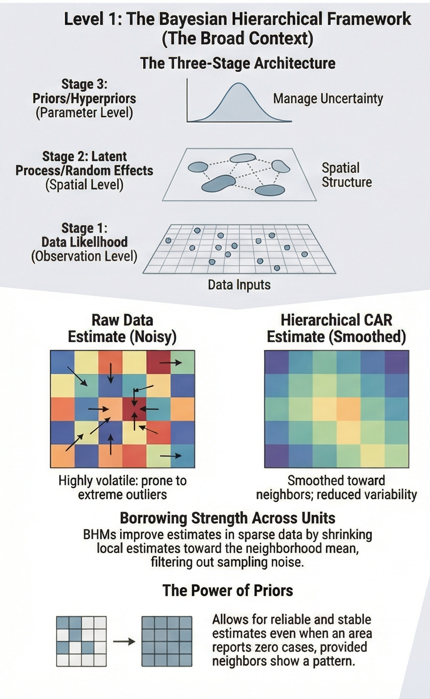

```{=latex}
\clearpage
```

# Set-up

```{r}
#| label: timestamp-setup
#| echo: false

knitted_when <- format(Sys.Date())
knitted_where <- knitr::current_input()
knitted_with <- packageVersion("knitr")
knitted_doc_url <- downlit::autolink_url("knitr::knit()")
```

Note updated on `r knitted_when` from `r knitted_where` with knitr version `r knitted_with`.

::: {.callout-note collapse="true"}
## General set-up of the program.

These notes make use of the following R packages and general set-up.

```{r}
#| label: set-up

  if (!require("pacman")) {
  install.packages("pacman")
  }

  #tinytex::reinstall_tinytex()
  #tinytex::tlmgr_install("fontawesome5") Only install once

  pacman::p_load(tidyverse 
                 ,tidylog
                 ,Cairo
                 ,here
                 ,dplyr
                 ,htmltools
                 ,SpatialEpi   # for pennLC data
                 ,crsuggest    # Suggest CRS information for spatial data
                 ,ggplot2  
                 ,ggnewscale   # For multiple fill and colour scales in ggplot2
                 ,sf           # DONT'T FORGET uses the s2geometry library
                 ,leaflet      # JavaScript libraries for interactive maps
                 ,leafem       # Extensions for leaflet 
                 ,knitr  
                 ,ragg         # Graphic devices based on the AGG library
                 ,downlit      # For syntax highlighting and automatic linking
                 ,git2r        # Provides access to 'Git' repositories
                 ,xfun         # For alternative Session Info
                 )
  
  #pacman::p_update()         # Update out-of-date packages

    options(scipen = 100, digits = 2)             # Prefer non-scientific notation
  
  knitr::opts_chunk$set( dev       = "ragg_png"
                        ,fig.path  = "Images/"
                        ,dpi       = 600
                        ,fig.width = 10
                        ,fig.hight = 12
  # Automatically formatting code using styler
                        ,tidy      = "styler"
)

```
:::

# Basic concepts

::: callout-note
## Spatial autocorrelation

As data redundancy, as missing spatial variables, and as a map pattern are different ways of viewing spatial autocorrelation, and all mutually implicate one another (Griffith, 1992).
:::

::: callout-note
## Spatial confounding

Following Hodges and Reich (2010), refers to the difference in estimates provided by spatial and nonspatial models, arising from correlation between covariates and the spatial trend, which can influence coefficient estimates (see critique in Donegan, 2025).
:::

::: callout-note
## Exchangeability (spatial)

When researchers observe discrete heterogeneity across different groups or contexts—such as distinct geographical units, time periods, or demographic cohorts—but lack a canonical theoretical mechanism to logically order, arrange, or differentiate these contexts a priori, the latent parameters governing these contexts are assumed to be exchangeable (Betancourt).

Rather than estimating each parameter in complete isolation, the hierarchical architecture allows observations within one specific context to inform the overarching hyperparameters, which consequently regularise the parameter estimates of all other exchangeable contexts (Betancourt).
:::

::: callout-note
## Prior distributions

Prior distributions place probabilities on parameter values before seeing the data; these beliefs are updated with observed data via Bayes’ rule to obtain posterior beliefs (e.g., Wagenmakers et al., 2018; Jeffreys, 1961).
:::

::: callout-note
## Jeffreys–Lindley paradox

Wide priors that spread mass over many possible effect sizes can make any specific effect unlikely a priori, so evidence can increasingly favor the null hypothesis in model comparison even when a classical test rejects it.
:::

::: callout-note
## Proper priors

A prior is proper if all probabilities are non‑negative and the distribution sums (discrete) or integrates (continuous) to 1 (Veenman et al., 2024).
:::

::: callout-note
## Conjugate priors

Conjugate priors are chosen so that the posterior distribution belongs to the same family as the prior, which often simplifies analytic or computational work (Fink, 1997).
:::

# Types of Models

Following "Cramb SM, Duncan EW, Baade PD, Mengersen KL, 2017. Investigation of Bayesian Spatial Models", two broad types of models were identified, namely "global" spatial smoothing models that have a common spatial smoothing term across the region, and "local" spatial smoothing models that allow for differential smoothing depending on neighbourhood characteristics.

The specific models that were identified in the literature are listed below:

- Global spatial smoothing:
  - Intrinsic CAR/BYM model (Besag et al., 1991)
  - Proper CAR model (Besag, 1974)
  - Leroux model (Leroux et al., 2000)
  - Geostatistical model (Clements et al., 2009)
  - Global spline models (Lang & Brezger, 2004)
- Local spatial smoothing
  - CAR dissimilarity models (Lee & Mitchell, 2012)
  - Localised autocorrelation (Lee & Mitchell, 2013)
  - Locally adaptive model (Lee & Sarran, 2015)
  - Hidden Potts model (Green & Richardson, 2002)
  - Spatial partition model (Knorr-Held & Raßer, 2000, Denison & Holmes, 2001)
  - Weighted sum of spatial priors (Lawson & Clark, 2002)
  - Leroux scale mixture model (Congdon, 2017)
  - Local spline models (Goicoa et al., 2012, Perperoglou & Eilers, 2010)
  - Skew-elliptical areal spatial models (Nathoo & Ghosh, 2013).

Specifically for identifying spatial step-changes, difference boundaries, or "social boundaries" the following models were designed to detect abrupt transitions in unobserved latent processes:

1.  Foundational Univariate Areal Wombling (Lu and Carlin, 2005)
2.  Stochastic Univariate Areal Wombling (Lu et al., 2007)
3.  Covariate-Driven Dissimilarity Models (Lee and Mitchell, 2012)
4.  Multivariate Boundary Detection
    - Site-Edge Shared (SESHARED) model (Ma and Carlin, 2007)
    - Multivariate Areally-Referenced Dirichlet Process (MARDP) model (Gao et al., 2023)
5.  Graph-Based and Spatio-Temporal Optimisation (Lee et al., 2018)

Recent developments and future research directions in Bayesian spatial modelling include the following:

Directional curvature extends first-order gradient wombling by examining second derivatives of a sufficiently smooth spatial surface. Gradients describe directional rates of change; curvature describes how those rates change. Halder, Banerjee, and Dey (2024) develop Bayesian inference for these processes and their integrals along curves, with posterior uncertainty for the resulting curvature measures.

The relevant differential object is the Hessian $H_Y(s)=\nabla\nabla^\top Y(s)$; curvature in a unit direction $v$ is $v^\top H_Y(s)v$. For a Matérn field, mean-square first derivatives require $\nu>1$, whereas second derivatives require $\nu>2$. Halder and Banerjee (2025) describe related point-referenced wombling tools in `nimblewomble`.

These continuous-process methods require a specified spatial domain and sufficient differentiability. They are mentioned for context here; the following models primarily concern areal observations and their neighbourhood graph (Lu and Carlin, 2005).

# From global models to local boundaries

We start with conceptual summaries of the hierarchical framework (@fig-HB) and model families (@fig-Bayesmodels). These AI-generated illustrations are schematic: smoothing may stabilise sparse-area estimates, including estimates for areas with zero observed cases, but does not guarantee accuracy or uncertainty calibration and may attenuate genuine boundaries (Lee and Mitchell, 2012). Model configuration is also complex; if no prior distribution on a given parameter is set, a default one will be used. Hence, it is important to know what the default priors are, as well as other possible alternatives.

As you embark on this journey, the road ahead is full of dead ends and uncertain bifurcations. This note aims to deepening your understanding of the complexities involved in selecting and configuring these type of models. One of the outstanding difficulties is choosing the type of prior that will appropriately characterise the spatial nature of the data of interest. Achieving a satisfactory level of smoothing is therefore a difficult task, which affects the plausibility of estimates. In general, a deep understanding of the data at hand is essential for the selection of (an) adequate model(s). Specially, identifying data characteristics (the likely disparities in neighbouring areas, considered to be likely if there is evidence of a trend across socioeconomic quintiles) will help to choose the most appropriate model.

{#fig-HB}

{#fig-Bayesmodels}

## Basic CAR Bayes

 The Besag–York–Mollié (BYM) model combines spatial borrowing and unstructured area-level variation (Besag et al., 1991). The worked example is adapted from [Moraga (2018)](https://journal.r-project.org/archive/2018/RJ-2018-036/RJ-2018-036.pdf).

**Main equation:**

$$ Y_i\mid\theta_i \sim \operatorname{Poisson}\left(\overset{\color{modelBlue}{\scriptstyle\text{Expected Count}}}{\boxBlue{E_i}}\quad\overset{\color{modelGreen}{\scriptstyle\text{Relative Risk}}}{\boxGreen{\theta_i}}\right) $$

$$
\log(\theta_i) =
\overset{\color{modelBlue}{\scriptstyle\text{Baseline / Covariates}}}{
  \boxBlue{
    \beta_0 + \mathbf{x}_i^\top \boldsymbol{\beta}
  }}
+
\b_i 
$$ where $$
\b_i =
\overset{\color{modelGreen}{\scriptstyle\text{Structured Spatial (iCAR)}}}{
  \boxGreen{
    u_i
  }}
+
\overset{\color{modelRed}{\scriptstyle\text{Unstructured Overdispersion}}}{
  \boxRed{
    v_i
  }}
$$

$$
u_i\mid u_{-i}\sim N\left(\frac{1}{n_{\delta_i}}\sum_{j\in\delta_i}u_j,\frac{\sigma_u^2}{n_{\delta_i}}\right),
\qquad v_i\stackrel{\mathrm{iid}}{\sim}N(0,\sigma_v^2).
$$

$Y_i$ is the observed count, $E_i$ the expected count from indirect standardisation, and $\theta_i$ the relative risk. $\beta_0$ is the intercept and $\mathbf{x}_i^\top\boldsymbol{\beta}$ the covariate contribution. The structured field $u$ has an ICAR prior; $\delta_i$ is area $i$'s neighbour set and $n_{\delta_i}$ its size. The IID field $v$, which represents unstructured, independent and identically distributed (i.i.d.) overdispersion/noise, is independent of $u$ a priori. The conditional formula assumes at least one neighbour. The worked example omits covariates.

BYM allows to combine spatial smoothing through $u_i$ with unstructured heterogeneity through $v_i$.

Nevertheless, \$b_i\$ is weakly distinguished by the data, as it is the sum of individual realizations of $u_i$ and $v_i$ , and cannot be uniquely distinguished without prior regularization (Riebler et al., 2016). Consequently, the posterior partition of variance between spatial smoothing and uncorrelated noise is highly sensitive to the specification of hyperpriors (Malgorzata et al., 2013). The structured marginal scale depends on the whole graph and is not directly comparable with the IID variance without scaling (Riebler et al., 2016). Weights-matrix choices affect smoothing but do not guarantee identification (Duncan, White, and Mengersen, 2017).

::: {.callout-note appearance="simple"}
## Operational note: graph and constraints

Match graph rows to area indices and check symmetry, components and singletons. An ICAR field needs component-aware constraints and appropriate singleton treatment (see Morris et al., 2019); adding artificial links changes the prior. For R-INLA, consult the [graph and constraint options in `f()`](https://www.r-inla.org/learnmore/docs/reference/f.html).
:::

The following example uses `CARBayes::S.CARbym()` and MCMC. Its sampling controls are described in the [CARBayes manual](https://cran.r-project.org/web/packages/CARBayes/CARBayes.pdf).

```{r}
#| label: data
#| include: false

source(here("Install.R")) # Has fillmap.R as dependency

# dependencies ‘Rgraphviz’, ‘graph’ are not available
library(INLA)
library(R2OpenBUGS)
library(CARBayes)
library(nimble)

# library(SpatialEpi)  # for pennLC [rdocumentation](https://www.rdocumentation.org/packages/SpatialEpi/versions/1.2.8/topics/pennLC)


```

```{r}
data(pennLC)
names(pennLC)
head(pennLC$data)
head(pennLC$smoking)
```

We calculate the expected number of cases in each county using indirect standardisation. The expected counts in each county represent the total number of disease cases one would expect if the population in the county behaved the way the Pennsylvania population behaves.

```{r}
# Add observed cases
pennLC$data <- pennLC$data %>%
  tibble() %>%
  group_by(county) %>%
  mutate(obs = sum(cases)) %>%
  ungroup()

# Add expected cases
pennLC$data <- pennLC$data %>%
  group_by(race, gender, age) %>%
  mutate(
    pop.strata   = sum(population),
    cases.strata = sum(cases)
  ) %>%
  group_by(county) %>%
  mutate(
    expected = population * cases.strata / pop.strata,
    expected = sum(expected)
  ) %>%
  ungroup()

# Summarise observed and expected; add SIR
pennLC$data <- pennLC$data %>%
  dplyr::select(county, obs, expected) %>%
  distinct() %>%
  mutate(SIR = obs / expected) %>%
  left_join(pennLC$smoking, by = "county")
```

```{r}
# Create sf object from SpatialPolygons
map <- st_as_sf(pennLC$spatial.polygon) %>%
  st_transform("+proj=longlat +datum=WGS84")

map <- cbind(map, pennLC$data)

pal <- colorNumeric(palette = "YlOrRd", domain = map$SIR)

# PDF uses the same colour mapping and geographic extent as the HTML maps.
static_risk_map <- function(values, title) {
  ggplot(map) +
    geom_sf(aes(fill = values), colour = "grey60", linewidth = 0.2) +
    scale_fill_gradientn(
      colours = pal(seq(min(map$SIR), max(map$SIR), length.out = 256)),
      limits = range(map$SIR), na.value = "#808080", name = title
    ) +
    coord_sf(datum = NA) +
    theme_void() +
    theme(legend.position = "bottom")
}
```

```{r}
# Observed SIR map
if (knitr::is_html_output()) {
leaflet(map) %>%
  addProviderTiles("CartoDB.Positron") %>%
  addPolygons(
    color       = "grey",
    weight      = 1,
    fillColor   = ~pal(SIR),
    fillOpacity = 0.7
  ) %>%
  addLegend(
    pal      = pal,
    values   = ~SIR,
    opacity  = 0.7,
    title    = "SIR",
    position = "bottomright"
  )
} else {
  print(static_risk_map(map$SIR, "Observed SIR"))
}
```

```{r}
# Labels
labels <- sprintf(
  "<strong>%s</strong><br/>Observed: %s <br/>Expected: %s 
   <br/>Smokers proportion: %s <br/>SIR: %s",
  map$county,
  map$obs,
  round(map$expected, 2),
  map$smoking,
  round(map$SIR, 2)
) %>%
  lapply(htmltools::HTML)

if (knitr::is_html_output()) {
leaflet(map) %>%
  addProviderTiles("CartoDB.Positron") %>%
  addPolygons(
    color           = "grey",
    weight          = 1,
    fillColor       = ~pal(SIR),
    fillOpacity     = 0.7,
    highlightOptions = highlightOptions(weight = 4),
    label           = labels,
    labelOptions    = labelOptions(
      style    = list("font-weight" = "normal", padding = "3px 8px"),
      textsize = "15px",
      direction = "auto"
    )
  ) %>%
  addLegend(
    pal      = pal,
    values   = ~SIR,
    opacity  = 0.7,
    title    = "SIR",
    position = "bottomright"
  )
} else {
  print(static_risk_map(map$SIR, "Observed SIR"))
}
```

Now we can examine the map and see which areas have

```         
SIR = 1 which indicates observed cases are the same as expected,
SIR > 1 which indicates observed cases are higher than expected,
SIR < 1 which indicates observed cases are lower than expected.
```

This map gives a sense of the disease risk across Pennsylvania. However, observed (raw) SIRs may be misleading and insufficiently reliable in counties with small populations. In contrast, model-based approaches enable the incorporation of covariates and borrow information from neighbouring counties to improve local estimates, resulting in the smoothing of extreme values based on small sample sizes.

Bayesian hierarchical models can be fitted using a number of approaches such as integrated nested Laplace approximation (INLA) (Rue, Martino, and Chopin 2009) and Markov chain Monte Carlo (MCMC) methods (Gelman et al. 2013).

Set-up:

As indicated before, the BYM model combines two random effects per area: a spatially structured CAR component and an unstructured i.i.d. component. The formula `obs ~ 1 + offset(log(expected))` models observed counts against expected counts, which is standard disease mapping setup yielding relative risk estimates.

The settings discard 10,000 initial iterations and retain 5,000 draws, for 15,000 iterations in total with the default thinning interval of one (reduces autocorrelation between stored draws, discarding post-burn-in iterations reduces the **Effective Sample Size (ESS)** per total computational time, see Agresti et al., 2026). These counts do not establish convergence; assess chain mixing, effective sample sizes and Monte Carlo uncertainty before interpreting the posterior summaries (Gelman et al., 2020).

```{r}
# Adjacency matrix, converting to binary numeric matrix
W <- st_touches(map) %>%
  as.matrix() * 1

M.burnin <- 10000
M        <- 5000

set.seed(111)

MCMC <- S.CARbym(
  formula  = obs ~ 1 + offset(log(expected)),
  data     = map,
  family   = "poisson",
  W        = W,
  burnin   = M.burnin,
  n.sample = M.burnin + M,
  verbose  = FALSE
)

print(MCMC$summary.results)
```

To obtain the modelled SIR, we need to divide the fitted values by the expected values.

We use `RR` to denote relative risk, which is the smoothed SIR (specifically, the median of the smoothed SIR), to distinguish it from the observed SIR. The posterior probability of the relative risk being greater than 1 (i.e. the proportion of MCMC iterations where the smoothed SIR is greater than 1) is also included, denoted by `PP` in the map area labels.

```{r}
# Posterior SIR and summary
y.fit <- MCMC$samples$fitted
SIR   <- t(t(y.fit) / map$expected)

map$SIR.50  <- apply(SIR, 2, median)
map$SIR.025 <- apply(SIR, 2, quantile, 0.025)
map$SIR.975 <- apply(SIR, 2, quantile, 0.975)
map$PP      <- apply(SIR, 2, function(x) length(which(x > 1))) / M

labels <- sprintf(
  "<strong>%s</strong> <br/>Observed: %s <br/>Expected: %s <br/>
   Smoker proportion: %s <br/>SIR: %s <br/>RR: %s (%s, %s) <br/>PP: %s",
  map$county,
  map$obs,
  round(map$expected, 2),
  map$smoking,
  round(map$SIR, 2),
  round(map$SIR.50, 2),
  round(map$SIR.025, 2),
  round(map$SIR.975, 2),
  round(map$PP, 3)
) %>%
  lapply(htmltools::HTML)

if (knitr::is_html_output()) {
leaflet(map) %>%
  addProviderTiles("CartoDB.Positron") %>%
  addPolygons(
    color           = "grey",
    weight          = 1,
    fillColor       = ~pal(SIR.50),
    fillOpacity     = 0.7,
    highlightOptions = highlightOptions(weight = 4),
    label           = labels,
    labelOptions    = labelOptions(
      style    = list("font-weight" = "normal", padding = "3px 8px"),
      textsize = "15px",
      direction = "auto"
    )
  ) %>%
  addLegend(
    pal      = pal,
    values   = ~SIR.50,
    opacity  = 0.7,
    title    = "Relative Risk",
    position = "bottomright"
  )
} else {
  print(static_risk_map(map$SIR.50, "Relative risk (posterior median)"))
}
```

## Proper CAR model

A proper CAR model introduces a spatial dependence parameter $\rho$ so that the joint Gaussian prior can be proper. This addresses the singularity of ICAR, rather than the allocation of variance between BYM's two fields.

**Main equation:**

$$
s_i \mid \mathbf{s}_{-i} \sim \mathcal{N}\left(
\overset{\color{modelPurple}{\scriptstyle\text{Autocorrelation Dampening}}}{
  \boxPurple{
    \frac{\rho}{\sum_j w_{ij}}
  }}
\sum_{j} w_{ij} s_j, \,
\overset{\color{modelGreen}{\scriptstyle\text{Conditional Variance}}}{
  \boxGreen{
    \frac{\sigma_s^2}{\sum_j w_{ij}}
  }}
\right)
$$

$s_i$ is the spatial effect, $W=(w_{ij})$ is a symmetric, non-negative weights matrix with zero diagonal, $D=\operatorname{diag}(d_i)$ with $d_i=\sum_j w_{ij}$, $\rho$ controls dependence, and $\sigma_s^2>0$ is a conditional scale parameter.

For symmetric non-negative weights with positive row sums, $-1<\rho<1$ is sufficient for $Q=\sigma_s^{-2}(D-\rho W)$ to be positive definite, where $D=\operatorname{diag}(\sum_jw_{ij})$. The maximal admissible interval depends on the eigenvalues of $D^{-1/2}WD^{-1/2}$. Isolated areas require a separate specification because the displayed conditional variance divides by the neighbour weight sum (Rue and Held, 2005).

The dependence parameter allows a proper Gaussian field for admissible values of $\rho$.

Neverheles, strong spatial association may require to set $\rho$ close to one under this parameterisation (Banerjee, Carlin, and Gelfand, 2014). A proper CAR near this limit is not interchangeable with ICAR: the intrinsic limit requires constraints and hence changes the prior specification.

::: {.callout-note appearance="simple"}
## Operational note: proper-CAR parameterisation

R-INLA's `besagproper` uses $Q=\tau(D-W+dI)$, not the displayed $Q=\sigma_s^{-2}(D-\rho W)$. Match the precision explicitly, for example through a custom Gaussian latent model; the names are not interchangeable. See the [model definition](https://www.inla.r-inla-download.org/r-inla.org/doc/latent/besagproper.pdf) and [`rgeneric` documentation](https://www.r-inla.org/learnmore/docs/reference/rgeneric.html).
:::

## Leroux model {#sec-leroux}

The Leroux model (Leroux, Lei, & Breslow, 2000) provides a single spatial effect that interpolates between independent and intrinsic CAR structures (Riebler et al., 2016; Cramb et al., 2017).

The model formulates the precision matrix of this single effect as a weighted average of the ICAR precision matrix and an independent identity matrix, governed by a spatial dependence parameter $\rho$.

**Main equation:**

$$
S_i \mid \mathbf{S}_{-i} \sim \mathcal{N}\left(
\frac{
  \overset{\color{modelGreen}{\scriptstyle\text{Structured Neighbour Pull}}}{
    \boxGreen{
      \rho \sum_{j} w_{ij} S_j
    }}
  + 
  \overset{\color{modelBlue}{\scriptstyle\text{Global Mean Pull}}}{
    \boxBlue{
      (1 - \rho) \mu_0
    }}
}{
  \rho \sum_j w_{ij} + 1 - \rho
}, \,
\overset{\color{modelPurple}{\scriptstyle\text{Convex Precision Mixture}}}{
  \boxPurple{
    \frac{\sigma_s^2}{\rho \sum_j w_{ij} + 1 - \rho}
  }}
\right)
$$

$S_i$ is the area effect, $\mu_0$ its common prior mean, $\sigma_s^2>0$ a scale parameter, and $w_{ij}$ symmetric non-negative weights with zero diagonal. The parameter $\rho$ balances the $\textcolor{modelGreen}{\text{neighbour}}$ $\textcolor{modelGreen}{\text{contribution}}$ against $\textcolor{modelBlue}{\text{shrinkage towards }\mu_0}$; the $\textcolor{modelPurple}{\text{precision}}$ $\textcolor{modelPurple}{\text{balance}}$ determines the conditional variance.

Note that the Leroux model is a generalisation of the ICAR model and the independent model (i.e. a model without any structured spatial random effect). At $\rho=1$, the precision becomes intrinsic and requires component-specific constraints. When $\rho$ is set to 0, the independent model is recovered. Thus the Leroux model attempts to find balance between these two models by estimating the value of $\rho$.

The Leroux model uses a single random-effect field, avoiding the explicit two-field allocation of BYM. However, its scale still depends on the graph and on $\rho$ (Riebler et al., 2016).

Notwithstanding, the weighting is a mixture of precision matrices, not an additive marginal variance decomposition; its parameter should not be read as the fraction of marginal variance explained by spatial structure (Riebler et al., 2016). Consequently, the true marginal variance under Leroux varies across individual nodes depending on local neighborhood graph topology, making it not comparable with another study region. But, also the model smooths peripheral or lower-degree regions differently from central regions strictly due to map topology rather than empirical spatial evidence (Riebler et al. 2017).

Estimating both $\mu_0$ and an unrestricted regression intercept duplicates the overall location. Use one location parameter; in a zero-mean random-effect formulation, retain the regression intercept.

::: {.callout-note appearance="simple"}
## Operational note: Leroux in R-INLA

`model="besagproper2"` implements $\tau[(1-\lambda)I+\lambda(D-W)]$: match $\lambda=\rho$ and $\tau=\sigma_s^{-2}$ for a zero-mean field. Check its hyperpriors and constraints; imposing centring changes a proper prior. The intrinsic endpoint needs separate treatment. See the [official model definition](https://www.inla.r-inla-download.org/r-inla.org/doc/latent/besagproper2.pdf).
:::

## BYM2 model

The BYM2 model, discussed by Simpson et al. (2017) and Riebler et al. (2016), reparameterises BYM using an overall precision and a mixing parameter $\phi$. Its structured component $u_*$ is scaled so that the geometric mean of its constrained marginal variances is one.

**Main equation:**

$$
b_i = 
\overset{\color{modelBlue}{\scriptstyle\text{Overall Scale}}}{
  \boxBlue{
    \frac{1}{\sqrt{\tau_\beta}}
  }}
\left(
\overset{\color{modelRed}{\scriptstyle\text{Unstructured Component}}}{
    \boxRed{
      \sqrt{1 - \phi} \, v_i
    }}
  + 
  \overset{\color{modelGreen}{\scriptstyle\text{Scaled Spatial Field}}}{
    \boxGreen{
      \sqrt{\phi} \, u_i^*
    }}
\right)
$$

$b_i$ is the combined area effect. The $\textcolor{modelRed}{v_i\sim N(0,1)}$ are independent of the $\textcolor{modelGreen}{\text{scaled structured field }u_*}$. The $\textcolor{modelBlue}{\tau_\beta}$ parameter controls overall scale, while $\phi\in[0,1]$ controls the mixture. At $\phi=0$ the field is IID; at $\phi=1$ it is entirely structured. Scaling sets the geometric mean of the constrained structured marginal variances to one, not each individual variance or their arithmetic mean (Riebler et al., 2016).

For BYM2, conditional on the hyperparameters, the area-specific variance and structured fraction are

$$
\begin{gathered}
\operatorname{Var}(b_i\mid\tau_\beta,\phi)=\textcolor{modelBlue}{\tau_\beta^{-1}}\left[(1-\phi)+\phi\textcolor{modelGreen}{v_i^*}\right],\\[1em]
\overset{\color{modelPurple}{\scriptstyle\text{Structured Variance Fraction}}}{\boxPurple{\frac{\phi v_i^*}{(1-\phi)+\phi v_i^*}}},\quad
v_i^*=\operatorname{Var}(u_i^*).
\end{gathered}
$$

The $\textcolor{modelGreen}{v_i^*}$ vary across areas. Thus $\textcolor{modelBlue}{\tau_\beta}$ is not the exact marginal precision at every area, and the $\textcolor{modelPurple}{\text{structured}}$ $\textcolor{modelPurple}{\text{variance}}$ $\textcolor{modelPurple}{\text{fraction}}$ need not equal $\phi$.

BYM2 makes prior specification and variance allocation more interpretable, although the data may still identify $\phi$ weakly.

**Limitations:**

a)  Formulating the convolved spatial random effect directly on its marginal scale yields a precision matrix that is **dense (non-sparse,** which would involve computational complexity in high dimensions), although an augmented representation preserves sparse computation (Riebler et al., 2016).
b)  Disconnected graphs require component-aware scaling and constraints, with appropriate handling of isolated areas (Morris et al., 2019).
c)  Spatially structured covariates and the random field may compete to explain variation in $\eta_i=\mathbf{x}_i^\top\boldsymbol{\beta}+b_i$; BYM2 scaling does not remove this potential spatial confounding.

::: {.callout-note appearance="simple"}
## Operational note: BYM2 in R-INLA

For the scaled, centred formulation, use `model="bym2"`, `scale.model=TRUE`, `constr=TRUE`, and component-aware handling (`adjust.for.con.comp=TRUE`). Specify and assess the `prec` and `phi` hyperpriors explicitly. See the [BYM2 documentation](https://www.inla.r-inla-download.org/r-inla.org/doc/latent/bym2.pdf) for scaling, constraints and prior parameterisations.
:::

## Geostatistical Models

Geostatistical models represent a continuous spatial field and allow prediction at unobserved locations. CAR models instead define dependence among discrete areas through a weights matrix (Banerjee, Carlin, and Gelfand, 2014). The Gaussian-response example below illustrates the continuous-field construction; other likelihoods can be used.

**Main equation:**

$$
Y(s) = 
\overset{\color{modelBlue}{\scriptstyle\text{Fixed Trend}}}{
  \boxBlue{
    X(s)^\top \boldsymbol{\beta}
  }}
+ 
\overset{\color{modelGreen}{\scriptstyle\text{Continuous Gaussian Process}}}{
  \boxGreen{
    S(s)
  }}
+ 
\overset{\color{modelRed}{\scriptstyle\text{Measurement Error}}}{
  \boxRed{
    \varepsilon(s)
  }}
$$

$s$ is a spatial coordinate and $Y(s)$ an observation. The $\textcolor{modelBlue}{\text{fixed trend }X(s)^\top\beta}$ is supplemented by $\textcolor{modelGreen}{S\sim\mathcal{GP}(0,C)}$ and independent $\textcolor{modelRed}{\varepsilon(s)\sim N(0,\tau^2)}$. A Matérn covariance is $C(h)=\frac{\sigma^2}{2^{\nu-1}\Gamma(\nu)}(\sqrt{2\nu}h/\kappa)^\nu K_\nu(\sqrt{2\nu}h/\kappa)$, where $h$ is Euclidean distance, $\nu$ controls smoothness, $\kappa>0$ is a length-scale parameter and $K_\nu$ is the modified Bessel function. Here $\kappa$ uses a length-scale convention, not the inverse-scale convention common in SPDE notation.

The continuous field supports interpolation and explicit aggregation over areas. For example, counts generated by a continuous intensity may be modelled as

$$
Y_i\mid\eta\sim\operatorname{Poisson}\left(\overset{\color{modelGreen}{\scriptstyle\text{Integrated Intensity}}}{\boxGreen{\int_{A_i}e(s)\exp\{\eta(s)\}\,ds}}\right),
$$

where $A_i$ is the observation area, $e(s)$ an exposure density, and $\eta(s)$ log-relative risk. Integrating the intensity generally differs from exponentiating the area-average latent field. Clements et al. (2009) provide a geostatistical disease-mapping application; the Gaussian response above is a generic illustration, not their count likelihood.

Notwithstanding, centroid evaluation approximates areal support; a mesh alone does not specify aggregation. Dense covariance factorisation typically costs $\mathcal{O}(N^3)$ for $N$ locations. Sparse approximations include SPDE models (Lindgren et al., 2011) and nearest-neighbour Gaussian processes (Datta et al., 2016); their accuracy depends on the approximation settings.

::: {.callout-note appearance="simple"}
## Operational note: SPDE in R-INLA

Specify the mesh, observation projection or integration, and range/variance priors explicitly; check mesh sensitivity. `inla.spde2.pcmatern()` uses `prior.range` and `prior.sigma` with different tail-probability conventions. See the [SPDE function documentation](https://www.r-inla.org/learnmore/docs/reference/inla.spde2.pcmatern.html). Cosider that a point-location projection does not automatically integrate areal counts.
:::

## Global Spline Models

Bayesian P-spline models (Lang & Brezger, 2004) estimate smooth spatial surfaces using tensor-product basis expansions with penalised random coefficients.

**Main equation:**

$$
\begin{gathered}
f(s_1, s_2) = 
\overset{\color{modelGreen}{\scriptstyle\text{Tensor-Product Basis Expansion}}}{
  \boxGreen{
    \sum_{j=1}^{K_1} \sum_{k=1}^{K_2} \beta_{jk} B_{1j}(s_1) B_{2k}(s_2)
  }},\\[1em]
\pi(\boldsymbol{\beta}\mid\lambda_1,\lambda_2)
\propto \exp\left\{-\tfrac12\boldsymbol{\beta}^{\top}
\mathbf{Q}_{\text{spline}}(\lambda_1,\lambda_2)\boldsymbol{\beta}\right\}
\end{gathered}
$$

$s_1,s_2$ are spatial coordinates; $B_{1j},B_{2k}$ are B-spline basis functions (the map is divided by a grid of smooth, overlapping “hills”, aka B-spline functions, along latitude and longitude), with $K_1,K_2$ basis functions per coordinate. Coefficients $\beta_{jk}$ and $\mathbf{Q}_{\text{spline}}(\lambda_1,\lambda_2)$ control “the height of each hill”. Larger penalties discourage roughness; they do not impose a hard bound on adjacent coefficients. A singular penalty needs an explicit treatment of its unpenalised null space (Lang and Brezger, 2004).

This formulation supports flexible, semiparametric trend estimation without specifying a distance-decay covariance kernel such as Matérn or exponential. It can capture gradients and curvature; the penalty parameters $\lambda_1,\lambda_2$ balance fit against surface roughness.

Nevertheless, the model is sensitive to basis “hills” placement and boundary edge effects, when applied to irregular administrative polygons (e.g., census tracts with varying areas and non-uniform centroid spacing), tensor products fail to respect irregular boundary geometries and spatial change-of-support (Cramb et al., 2017). The model inherently enforces global smoothness, which obscures localised spatial cliffs. Tensor-product bases with many “hills” can become computationally expensive for high-dimensional spatial domains.

::: {.callout-note appearance="simple"}
## Operational note: spline precision in R-INLA

To reproduce this prior, supply the basis-to-observation mapping and matching coefficient precision, including its null-space treatment. A grid-based spatial smoother is not automatically the same tensor-product spline. Custom Gaussian priors can use [`rgeneric`](https://www.r-inla.org/learnmore/docs/reference/rgeneric.html); see [`f()`](https://www.r-inla.org/learnmore/docs/reference/f.html) for constraints.
:::

## CAR Dissimilarity Model

A continuous dissimilarity-weighted CAR specification adjusts spatial borrowing through symmetric non-negative weights. CARBayes implements both continuous and binary dissimilarity weights (Lee, 2013; Lee, n.d.). The continuous variant below attenuates borrowing, whereas the Lee and Mitchell (2012) rule in **Covariate-Driven Dissimilarity Models** removes edges:

**Main equation:**

$$w_{ij} = \overset{\color{modelOrange}{\scriptstyle\text{Covariate Dissimilarity Penalty}}}{\boxOrange{\exp\left( - \alpha \, \frac{|z_i - z_j|}{\sigma_z} \right)}} \cdot \overset{\color{modelGreen}{\scriptstyle\text{Contiguity Base}}}{\boxGreen{\mathbb{I}(i \sim j)}}$$

$z_i$ is the chosen area-level characteristic or difference value. Here $\textcolor{modelGreen}{\mathbb{I}(i\sim j)}$ indicates geographical adjacency, and $\textcolor{modelOrange}{\alpha|z_i-z_j|/\sigma_z}$ is the dissimilarity penalty, with decay parameter $\alpha\geq0$ and a specified positive scale $\sigma_z$.

Setting $\alpha=0$ recovers binary geographical contiguity. For finite $\alpha$, adjacent-edge weights remain positive, so the original connectivity is retained. The corresponding Leroux precision is $Q=\tau[(1-\rho)I+\rho(D_W-W)]$, with $\tau>0$, $0\leq\rho<1$ and $D_W=\operatorname{diag}(\sum_jw_{ij})$; under these conditions it is proper (Lee, 2013; Lee, n.d.).

This is the Leroux construction in @sec-leroux with modified weights in both the degree matrix and off-diagonal terms.

Consider that dissimilarity scaling and the prior for $\alpha$ jointly determine attenuation; changing the scale without adjusting that prior changes the model. The response likelihood informs $\alpha$, and joint estimation of local attenuation, global dependence and scale may be weakly identified. Lee and Mitchell (2012) fix $\rho=0.99$; Aiello and Banerjee (2026) instead estimate DAGAR dependence jointly with a boundary parameter.

For continuous weights, report a declared boundary event such as $P(w_{ij}<c_w\mid Y)$, $0<c_w<1$, and its decision threshold as small weights are not literal edge removal or necessarily large risk contrasts.

::: {.callout-note appearance="simple"}
## Operational note: continuous weights

`CARBayes::S.CARdissimilarity(W.binary=FALSE)` uses continuous weights and fixes $\rho=0.99$. A fixed graph supplied to INLA does not estimate $\alpha$ automatically; unknown weights need a matching custom precision and hyperparameter specification. See the [CARBayes manual](https://cran.r-project.org/web/packages/CARBayes/CARBayes.pdf) and [INLA `rgeneric` documentation](https://www.r-inla.org/learnmore/docs/reference/rgeneric.html).
:::

**Configuration example.** `areal` has one row per area, outcome `Y`, positive expected counts/exposure `E` and covariate `x`; `W` is a symmetric binary adjacency matrix in the same order, with zero diagonal. Package defaults are identified explicitly; family, iteration counts and decision thresholds are analysis choices.

Documentation: [CARBayes, S.CARdissimilarity](https://cran.r-project.org/web/packages/CARBayes/CARBayes.pdf).

```{r}
#| label: car-dissimilarity-continuous
#| eval: false
#| echo: true
#| code-fold: false
#| code-summary: "Model configuration"

# Z: list of symmetric, non-negative dissimilarity matrices, aligned with W.
# Define each dissimilarity scale before fitting; do not change it silently.
fit_continuous <- CARBayes::S.CARdissimilarity(
  Y ~ x + offset(log(E)), family = "poisson", data = areal,
  W = W, Z = Z, W.binary = FALSE, # Override TRUE: downweight, do not delete edges.
  prior.mean.beta = NULL, prior.var.beta = NULL, # Defaults: N(0, 100000).
  prior.tau2 = c(1, 0.01), # Default inverse-gamma(shape, scale) spatial variance.
  burnin = 20000, n.sample = 100000, # Illustrative lengths, not defaults.
  thin = 1, n.chains = 4, n.cores = 1 # No thinning; four chains override default 1.
)
```

Consider:

- rho is fixed at 0.99; alpha's prior/support is specified by the package.

- There is no BYM2 scale.model switch here.

- Alternatives: binomial + trials; Gaussian without the count offset adds residual variance prior.nu2 (default c(1, 0.01)).

- Inspect samples, acceptance, model fit and boundary-summary mixing.

## Locally Adaptive Model

Whereas dissimilarity models modify spatial weights, the locally adaptive model of Lee and Sarran (2015) combines an ICAR field on a fixed geographical graph $W$ with a piecewise-constant intercept process $\lambda_{Z_i}$:

**Main equation:**

$$ \log(\theta_i) = \mathbf{x}_i^\top \boldsymbol{\beta} + \textcolor{modelGreen}{u_i} + \overset{\color{modelPurple}{\scriptstyle\text{Group Intercept}}}{\boxPurple{\lambda_{Z_i}}}, \qquad Z_i \in \{1, \ldots, G\}
$$

$$
\lambda_1<\cdots<\lambda_G,\qquad
P(Z_i=r\mid\delta)=
\frac{\exp[-\delta(r-G^*)^2]}{\sum_{h=1}^{G}\exp[-\delta(h-G^*)^2]},
\qquad \delta\sim\operatorname{Uniform}(1,M).
$$

$\theta_i$ is relative risk, $\mathbf{x}_i^\top\boldsymbol{\beta}$ the covariate contribution without a global intercept, and $u$ a centred ICAR field on fixed $W$ with scale $\sigma_u^2$. $Z_i$ selects one of at most $G$ ordered intercepts. For odd $G$, $G^*=(G+1)/2$; CARBayes uses $G^*=G/2$ for even $G$. The penalty $\delta$ controls shrinkage toward $G^*$ and $M>1$ bounds its prior. Choosing small $G$ restricts the number of intercept levels; it is $\delta$ that controls allocation shrinkage (Lee, 2013; Lee, n.d.).

Ordering removes label switching, while omitting the global intercept and centring the ICAR field address location confounding. These are distinct constraints; disconnected graphs need component-specific treatment (Lee, 2013; Lee, n.d.; Morris et al., 2019).

**This model allows for boundary uncertainty quantification.** The ICAR field continues to smooth across the original graph, including edges with different group allocations. Distinguish an allocation boundary from a total log-risk contrast:

$$
\begin{gathered}
\overset{\color{modelPurple}{\scriptstyle\text{Allocation Boundary}}}{\boxPurple{p_{ij}^{Z}=P(Z_i\ne Z_j\mid Y)}},\\[1em]
\overset{\color{modelRed}{\scriptstyle\text{Log-Risk Contrast}}}{\boxRed{p_{ij}^{\eta}(c)=P(|\log\theta_i-\log\theta_j|>c\mid Y)}}.
\end{gathered}
$$

The $\textcolor{modelPurple}{\text{allocation probability }p_{ij}^{Z}}$ concerns the intercept component; the $\textcolor{modelRed}{\text{contrast probability }p_{ij}^{\eta}(c)}$ also reflects covariates and the smooth field, for a specified practical threshold $c>0$.

**Neverthelsss,** $G$ bounds the number of intercept levels, not the number of total risk values. Assess sensitivity to $G$, $M$ and shrinkage priors. The allocation prior does not require contiguous groups, so isolated allocations can occur. Binary boundary maps require an explicit decision threshold and assessment of false-positive/false-negative costs (Gao et al., 2023).

Joint sampling of allocations and continuous effects can mix slowly. Assess multiple chains, effective sample sizes and Monte Carlo uncertainty for boundary summaries; fixed burn-in or thinning does not establish convergence (Gelman et al., 2020; Link and Eaton, 2012).

::: callout-warning
## Operational warning: discrete allocations

A standard single INLA fit does not integrate the unknown group allocations. `CARBayes::S.CARlocalised()` uses MCMC for this hierarchy; see its [package documentation](https://cran.r-project.org/web/packages/CARBayes/CARBayes.pdf) for allocation priors, intercept handling and sampling controls.
:::

**Configuration example.** Defaults below follow CARBayes 6.1.1 version; `G`, the family and sampling lengths require explicit choices. Documentation: [function arguments](https://cran.r-project.org/web/packages/CARBayes/CARBayes.pdf) and [model/prior specification](https://cran.r-project.org/web/packages/CARBayes/vignettes/CARBayes.pdf).

```{r}
#| label: locally-adaptive-model
#| eval: false
#| echo: true
#| code-fold: false
#| code-summary: "Model configuration"

# One response per area; W rows must match areal rows.
# This function requires non-missing responses and a neighbour in every row.
# Treat islands explicitly; do not add arbitrary links merely to pass validation.
fit_local <- CARBayes::S.CARlocalised(
  Y ~ x + offset(log(E)), # Keep normal R formula syntax: see intercept note below.
  family = "poisson", data = areal, W = W,
  G = 3, # Chosen maximum intercept groups, not a package default; assess sensitivity.
  prior.mean.beta = NULL, # Default zero means for covariate coefficients.
  prior.var.beta = NULL,  # Default variances 100000: broad, not "non-informative".
  prior.tau2 = c(1, 0.01), # Default inverse-gamma(shape, scale) for ICAR variance.
  prior.delta = 10, # Default upper bound M for allocation shrinkage delta.
  burnin = 20000, n.sample = 100000, # Chosen total iterations per chain, incl. burn-in.
  thin = 1, # Default: retain every post-burn-in draw.
  n.chains = 4, n.cores = 1, # Four chains for diagnostics; package defaults are 1, 1.
  MALA = TRUE # Default gradient-based Metropolis updates for regression coefficients.
)
```

Consider:

- INTERCEPT: 'S.CARlocalised' removes the formula intercept internally.

- Ordered group intercepts supply location. Do not add another constant covariate.

- Do not mechanically change the formula to - \~ 0 + x - : this implementation expects an intercept column and can otherwise drop covariates.

- SCALING: continuous covariates are standardised internally; check the vignette when eliciting coefficient priors. ICAR variance is graph-dependent.

- There is no scale.model/phi option: this is not BYM2.

- OUTCOME: for successes Y out of N, use family="binomial", 'trials = areal\$N' and 'Y \~ x' (remove the exposure offset). The link then models log-odds.

- 'S.CARlocalised' does not support Gaussian or negative-binomial outcomes.

- A different outcome requires a supported alternative, not just a renamed family.

- DIAGNOSTICS: inspect 'fit_local$samples' and 'fit_local$accept'.

- Check multiple-chain $\hat{R}$, bulk/tail ESS and Monte Carlo error for both parameters and edge events, e.g. Z_i != Z_j; extend chains if needed.

- 'fit_local\$modelfit' contains fit scores, not a convergence certificate.

- Posterior median group labels alone do not measure boundary uncertainty.

## Localised Autocorrelation Model

Lee and Mitchell (2013) proposed an alternative to joint graph sampling: alternating conditional INLA fits with deterministic updates of the adjacency matrix. The resulting inference is conditional on a selected graph. The procedure, as applied by Dean et al. (2019), is summarised below:

**Main equation (alternating update):**

$$
\overset{\color{modelBlue}{\scriptstyle\text{Conditional Fit}}}{\boxBlue{\pi(\boldsymbol{\Theta}\mid\mathbf{Y},\mathbf{W}^{(k)})}}\quad\longrightarrow\quad
\overset{\color{modelOrange}{\scriptstyle\text{Graph Update}}}{\boxOrange{\mathbf{W}^{(k+1)}}}
$$

$\boldsymbol{\Theta}$ contains the continuous model parameters and latent effects, $\mathbf{Y}$ the observations, $W^{(k)}$ the graph at iteration $k$. The $\textcolor{modelBlue}{\text{conditional}}$ $\textcolor{modelBlue}{\text{fit}}$ supplies marginal intervals for the $\textcolor{modelOrange}{\text{graph}}$ $\textcolor{modelOrange}{\text{update}}$:

1.  **Conditional Fitting:** Initialise with independent random effects, setting the Leroux dependence parameter to zero; geographical adjacency defines the candidate edges. Subsequent `R-INLA` fits condition on the updated graph to obtain marginal posteriors for the spatial effects.

2.  **Deterministic Edge Updating:** For each geographically adjacent pair $(i\sim j)$, evaluate overlap of the marginal $95\%$ credible intervals. Edges can be removed or reinstated:

    - **Include edge** ($w_{ij}^{(k+1)}=1$): if the intervals overlap.
    - **Remove edge** ($w_{ij}^{(k+1)}=0$): if the intervals do not overlap.

3.  **Termination and Cycle Selection:** Stop when $W^{(k+1)}=W^{(k)}$ or a cycle recurs. For a cycle, select the graph with the smallest absolute residual Moran's $I$, rather than the most negative signed value. This is a selection criterion, not a guarantee of a globally optimal graph.

This procedure identifies local breaks through repeated conditional fits without jointly sampling the graph.

**Limitations:**

**Selection Procedure vs. Joint Posterior Inference:** Graph updating is a deterministic model selection heuristic rather than joint Bayesian posterior sampling over the graph space $\pi(\mathbf{W}, \boldsymbol{\Theta} \mid \mathbf{Y})$.

**Conditional Uncertainty:** Final inference conditions on the selected graph $W^*$ and omits graph-selection uncertainty. A particular conditional credible interval is not necessarily narrower than its model-averaged counterpart, but it does not represent uncertainty over alternative graphs.

**Informal Boundary Criterion:** Interval overlap supplies the edge-update rule; graph stability or cycling determines termination. Overlap is neither a posterior boundary probability $P(w_{ij}=0\mid Y)$ nor a calibrated test of the joint contrast $u_i-u_j$, and does not itself control multiplicity.

**Subgraph Partitioning Constraints:** Updated graphs can contain disconnected components or singletons. Intrinsic specifications require component-aware constraints and singleton treatment (Morris et al., 2019). A proper Leroux precision with $\rho<1$ remains non-singular for these graphs; ICAR constraints are not required merely because edges are removed.

::: callout-note
## Application note: social-frontier decision

Dean et al. (2019) applied this framework to residential segregation. In addition to graph selection, they required an effect contrast exceeding a chosen mean-plus-one-standard-deviation threshold to label an edge a social frontier. This application-specific rule should be distinguished from the graph-update criterion.
:::

::: {.callout-note appearance="simple"}
## Operational note: graph updates in R-INLA

Rebuild the graph input for each conditional fit and match its area ordering and component treatment. A single `inla()` call does not perform the outer graph-selection procedure. Consult [`f()` graph and constraint options](https://www.r-inla.org/learnmore/docs/reference/f.html); final conditional draws omit graph-selection uncertainty.
:::

**Configuration example.** This is one conditional fit in the alternating procedure, not the outer graph-update algorithm or a joint graph posterior. Documentation: [R-INLA besagproper2](https://www.inla.r-inla-download.org/r-inla.org/doc/latent/besagproper2.pdf).

```{r}
#| label: localised-autocorrelation-model
#| eval: false
#| echo: true
#| code-fold: false
#| code-summary: "Model configuration"

library(INLA)
# areal$area_id = 1,...,n in W_current order.
# W_current is the graph supplied by the preceding deterministic update.
fit_conditional <- inla(
  Y ~ 1 + x + f(area_id, model = "besagproper2", graph = W_current,
    constr = FALSE, # Proper field; do not impose ICAR centring by habit.
    hyper = list(
      prec = list(prior = "loggamma", param = c(1, 0.0005)),
      lambda = list(prior = "gaussian", param = c(0, 0.45))
    )), # Documented priors: log precision / logit dependence; review sensitivity.
  family = "poisson", data = areal, E = areal$E,
  control.compute = list(dic = TRUE, waic = TRUE, cpo = TRUE, config = TRUE)
)
```

Consider:

- Initial rho=0 fit needs an independent field; do not set logit(lambda) to -Inf.
- Update candidate edges from 95% marginal intervals, then refit and check cycles.
- The loop must implement the stated stopping/selection rule; it is not shown here.
- Inspect 'fit_conditional$cpo$failure'; graph stability is not posterior graph certainty.

## Leroux Scale Mixture Model

Scale-mixture models offer a different mechanism for accommodating local heterogeneity (Congdon, 2017). Area-specific weights $\omega_i$ modify conditional variability and neighbouring contributions while retaining the original geographical graph. The following conditional specification requires restrictions for joint validity, as discussed below.

**Main equation:**

The proposed conditional moments and mixing law are:

$$
\operatorname{Var}(S_i \mid \mathbf{S}_{-i}, \boldsymbol{\omega})
=
\frac{\sigma_s^2}{
  \overset{\color{modelRed}{\scriptstyle\text{Heavy-Tailed Scale Weight}}}{
    \boxRed{\omega_i}
  }
  \cdot
  \overset{\color{modelPurple}{\scriptstyle\text{Leroux Precision Balance}}}{
    \boxPurple{(1-\rho+\rho d_i)}
  }
}
$$

$$
\operatorname{E}(S_i \mid \mathbf{S}_{-i}, \boldsymbol{\omega})=
\frac{\rho \sum_{j} w_{ij}\omega_j S_j}
     {1-\rho+\rho d_i}.
$$

$$
\omega_i \sim \operatorname{Gamma}\!\left(\frac{\nu}{2}, \frac{\nu}{2}\right),
$$

$S_i$ is the spatial effect, $W$ the symmetric geographical weights, $d_i=\sum_jw_{ij}$ the weighted degree, $\sigma_s^2>0$ a scale, and $0\leq\rho<1$ the Leroux dependence parameter. Positive local weights $\omega_i$ affect both conditional moments; $\nu>0$ controls the proposed Gamma law in shape–rate form, with mean one. These conditionals define a usable Gaussian field only when their joint precision is positive definite (Michal et al., 2025).

Within a valid joint specification, small $\omega_i$ increases conditional variance and reduces area $i$'s contribution to neighbouring conditional means. This can accommodate anomalies but also weaken borrowing between neighbouring outliers (Michal et al., 2025). At $\rho=0$, independent Gamma mixing produces independent Student-$t_\nu$ effects. For $\rho>0$, it does not generally produce a multivariate Student-$t$ process.

Notwithstanding, full conditional distributions do not automatically guarantee a valid joint multivariate Gaussian distribution of:

$$
\mathcal{N}\!\left(\mathbf{0},\mathbf{Q}(\boldsymbol{\omega})^{-1}\right).
$$

The displayed conditional moments imply the following candidate precision:

$$
\begin{aligned}
Q_{ii}
&=
\frac{\omega_i(1-\rho+\rho d_i)} {\sigma_s^2},\\[1em]
Q_{ij} 
&=
-\frac{\rho\,w_{ij}\,\omega_i\omega_j} {\sigma_s^2},
\qquad i \neq j
\end{aligned}
$$

Symmetry is necessary but insufficient for propriety. With non-negative symmetric $W$, positive scales and $0\leq\rho<1$, a sufficient strict diagonal-dominance condition is:

$$
\overset{\color{modelPurple}{\scriptstyle\text{Diagonal Contribution}}}{\boxPurple{1-\rho+\rho d_i}}
>
\overset{\color{modelRed}{\scriptstyle\text{Weighted Neighbour Contribution}}}{\boxRed{\rho\sum_{j\ne i}w_{ij}\omega_j}},\qquad\text{for every }i.
$$

The $\textcolor{modelPurple}{\text{diagonal}}$ $\textcolor{modelPurple}{\text{contribution}}$ need not exceed the $\textcolor{modelRed}{\text{weighted}}$ $\textcolor{modelRed}{\text{neighbour}}$ $\textcolor{modelRed}{\text{contribution}}$ for arbitrary positive scales. For two neighbouring areas, $\rho=0.9$, $\omega_1=\omega_2=2$ and $\sigma_s^2=1$ give $Q=\left(\begin{smallmatrix}2&-3.6\\-3.6&2\end{smallmatrix}\right)$, with eigenvalues $-1.6$ and $5.6$. Thus an unrestricted Gamma prior assigns positive probability to invalid configurations. A usable model must specify support on which $Q\succ0$, with the corresponding normalisation, or adopt a different valid scale-mixture construction. Restricting the scales changes their joint mixing distribution; the unrestricted independent-Gamma claim cannot then be retained (Michal et al., 2025; Rue & Held, 2005).

::: callout-warning
## Operational warning: validity and dimension

First establish a valid joint prior; changing the sampler cannot repair an indefinite precision. One unknown scale per area also exceeds the usual low-dimensional hyperparameter setting of INLA (Rue et al., 2009). See [`rgeneric` requirements](https://www.r-inla.org/learnmore/docs/reference/rgeneric.html) before considering custom or hybrid computation.
:::

**Configuration example.** No safe default fitter is given for the unrestricted scale-mixture conditionals above. Documentation: [INLA custom precision requirements](https://www.r-inla.org/learnmore/docs/reference/rgeneric.html).

Consider:

  - Do not fit until the missing prior/precision choices are resolved.

  - Independent positive Gamma scales alone do not guarantee joint validity.

  - Standard INLA integration is not a default solution for one scale per area.

# Lets Go Kinky: The Conceptual Evolution of Wombling

Wombling originates in Womble's (1951) study of biological differentiation. Boundary analysis includes both abrupt contrasts between areal units and rapid changes in continuous surfaces (Fitzpatrick et al., 2010; Banerjee & Gelfand, 2006). Related approaches to identifying and bounding social neighbourhoods are discussed by Logan et al. (2011) and Spielman & Logan (2013).

In modern spatial statistics, boundary analysis is distinct from cluster analysis. While the latter focuses on classifying regions into homogeneous groups, boundary analysis prioritizes the transition itself, **the "line" or "curve" where the spatial gradient is steepest**, that is, finding "kinks" in a spatial surface rather than "clumps" of similar values.

Areal boundary analysis focuses on contrasts between neighbouring areas, rather than only on similarity within clusters (Lu and Carlin, 2005).

These models are extensively used in public health, to identify areas where disease patterns change abruptly (Jacquez, 2010) and ecology to detect ecotones, which are zones of rapid change in species composition (Dale & Fortin, 2014).

## Paradigms of Boundary Elements

### The Curvilinear Boundary Fallacy (CBF)

Curvilinear Boundary Fallacy (CBF) concerns transferring boundary conclusions between spatial supports (Qu, Bradley, & Niu, 2021). For an area average $\bar Y_A$, its variance is

$$
\operatorname{Var}(\bar Y_A)=\frac{1}{|A|^2}\int_A\int_A C(s,t)\,ds\,dt,
$$

which depends on covariance, polygon size, and shape; it is not universally proportional to $1/|A|$. Areal and continuous boundary targets therefore need an explicit change-of-support model rather than treating centroid derivatives as equivalent to contrasts between areal averages.

The following section is based on [this website](https://www.passagesoftware.net/webhelp/Wombling_Analysis.htm)

Traditional boundary detection is often bifurcated into categorical and continuous methods, depending on the spatial configuration and the data structure under investigation.

| Wombling Category | Data Structure | Elemental Definition | Quantitative Metric |
|------------------|------------------|------------------|------------------|
| Categorical | Surface or Scattered | Line segments or tessellation edges | Inter-point distance or dissimilarity |
| Continuous | Grid or Triangulated | Centroids of geometric units | First partial derivatives (gradients) |

Categorical wombling, sometimes referred to as two-point wombling, identifies boundary elements as line segments between adjacent data points. In a lattice or surface data setting, these elements correspond to the common edges of adjacent cells. For scattered point data, a Voronoi tessellation is typically constructed to define the boundaries, where the magnitude of change is calculated as the distance (often multivariate) between the data points on either side. **Notably, categorical wombling does not produce a directional vector, focusing solely on the magnitude of disparity.**

In the classical algorithmic approach, continuous wombling estimates gradient magnitude and direction from local grids or triangulations, then connects candidate boundary elements using magnitude and angular criteria. Model-based curvilinear wombling instead supports posterior inference for derivatives and their integrals (Banerjee and Gelfand, 2006). For a differentiable latent surface $f$ and curve $C$ with unit normal $n(s)$,

$$
\begin{gathered}
\overset{\color{modelGreen}{\scriptstyle\text{Normal Gradient}}}{\boxGreen{D_nf(s)=n(s)^\top\nabla f(s)}},\\[1em]
\overset{\color{modelPurple}{\scriptstyle\text{Integrated Signed Change}}}{\boxPurple{\Gamma(C)=\int_C D_nf(s)\,d\ell}}.
\end{gathered}
$$

The $\textcolor{modelGreen}{\text{normal}}$ $\textcolor{modelGreen}{\text{gradient}}$ describes local change; the $\textcolor{modelPurple}{\text{signed}}$ $\textcolor{modelPurple}{\text{integral}}$ accumulates it along the curve and can cancel opposing changes. Directional curvature, $v^\top H_f(s)v$, is a second-derivative target, distinct from both gradient measures and areal contrasts (Halder et al., 2024).

## General guidance for boundary models

These decisions apply across the models below; package defaults do not settle them.

- **Define the boundary target and decision rule.** A large risk contrast, different group labels and an absent graph edge are distinct events. State the effect scale and practical threshold, show posterior probabilities, and assess threshold sensitivity. With many candidate edges, consider an explicit Bayesian false-discovery criterion ([Lu and Carlin, 2005](https://doi.org/10.1111/j.1538-4632.2005.00624.x); [Gao et al., 2023](https://doi.org/10.1093/biostatistics/kxac013)).

- **Match the observation model to the data.** Counts need appropriate exposure or expected counts; binomial outcomes need denominators, not percentages alone. Areal aggregation limits interpretation: a boundary in adjusted area-level risk is not automatically an individual-level or causal divide ([Wakefield, 2007](https://doi.org/10.1093/biostatistics/kxl008)).

- **Check graph and prior sensitivity.** Verify area ordering, adjacency and disconnected components. Scaling, constraints and singleton handling are model-specific. Assess plausible changes to scale/mixing priors and, where relevant, group counts or dissimilarity scales; “default” does not mean uninformative ([Riebler et al., 2016](https://doi.org/10.1177/0962280216660421); [Morris et al., 2019](https://doi.org/10.1016/j.sste.2019.100301)).

- **Distinguish uncertainty from numerical error.** Graph-selection fits condition on their selected graph; they do not integrate graph uncertainty. For MCMC, inspect multiple chains, rank-normalised $\widehat R$, effective sample sizes and Monte Carlo error for boundary summaries as well as model parameters. More INLA posterior draws reduce sampling noise, not approximation bias ([Lee and Mitchell, 2013](https://doi.org/10.1111/rssc.12009); [Vehtari et al., 2021](https://doi.org/10.1214/20-BA1221); [Rue et al., 2009](https://doi.org/10.1111/j.1467-9868.2008.00700.x)).

- **Validate prediction and boundaries separately.** Choose pointwise or spatially grouped validation to match deployment. Also examine posterior predictive spatial contrasts and, in simulations with known boundaries, false detections and missed boundaries. Good predictive scores alone do not establish boundary recovery ([Roberts et al., 2017](https://doi.org/10.1111/ecog.02881); [Gao et al., 2023](https://doi.org/10.1093/biostatistics/kxac013)).

## Foundational Univariate Areal Wombling (Lu and Carlin, 2005)

Lu and Carlin (2005) develop Bayesian areal boundary analysis. For a chosen latent relative-risk target $\theta_i$, adjacent-area contrasts can be summarised by posterior differences and exceedance probabilities:

**Main equation (boundary summary):**

$$
\Delta_{ij}^{\text{latent}} = 
\overset{\color{modelGreen}{\scriptstyle\text{Latent Risk Difference}}}{
  \boxGreen{
    |\theta_i - \theta_j|
  }}
\quad \longrightarrow \quad
\mathbb{E}[\Delta_{ij} \mid \mathbf{Y}], \quad \mathbb{P}(\Delta_{ij} > c \mid \mathbf{Y})
$$

For joint posterior draws, estimate the exceedance probability as

$$
\overset{\color{modelRed}{\scriptstyle\text{Posterior Exceedance Estimate}}}{\boxRed{\widehat p_{ij}(c)=\frac1M\sum_{m=1}^{M}\mathbb I\{|\theta_i^{(m)}-\theta_j^{(m)}|>c\}}}.
$$

$\theta_i$ is latent relative risk in area $i$, $\Delta_{ij}$ its absolute contrast across an adjacent pair, $Y$ the observations, $c>0$ a practical difference threshold, and $M$ the number of joint draws; superscript $(m)$ indexes a draw.

Paired draws propagate uncertainty while preserving dependence between areas. Log-risk and residual contrasts answer different questions; a removed graph edge is a distinct event from a substantively large risk contrast.

**Limitations:** Global smoothing can attenuate sharp contrasts. Choose a practical threshold $c>0$ and a posterior decision threshold explicitly; under a non-degenerate continuous prior, exact inequality generally has probability one. Consider multiplicity and assess boundary recovery as well as predictive fit (Gao et al., 2023; Lu & Carlin, 2005).

::: {.callout-note appearance="simple"}
## Operational note: posterior contrasts in R-INLA

Fit with `control.compute=list(config=TRUE)`, then use `inla.posterior.sample()` for joint approximate posterior draws. Compute both areas' risks within each draw; independent marginal samples lose their dependence. See the [posterior-sampling documentation](https://www.r-inla.org/learnmore/docs/reference/posterior.sample.html). These are samples from INLA's approximation, not an MCMC chain.
:::

**BYM2 configuration for post-hoc boundary contrasts.** This is a global smoothing baseline for the boundary summaries above, not an edge-selection model. Priors match the documented BYM2 defaults; fixed-effect priors and diagnostic options are made explicit. Documentation: [BYM2](https://www.inla.r-inla-download.org/r-inla.org/doc/latent/bym2.pdf), [fixed effects](https://www.r-inla.org/learnmore/docs/reference/control.fixed.html), [families](https://www.r-inla.org/learnmore/docs/reference/control.family.html) and [joint sampling](https://www.r-inla.org/learnmore/docs/reference/posterior.sample.html).

```{r}
#| label: bym2-areal-wombling
#| eval: false
#| echo: true
#| code-fold: false
#| code-summary: "Model configuration"

library(INLA)
# areal: one row per polygon; Y counts; E positive expected counts/exposure.
# W: symmetric binary adjacency in exactly this row order; zero diagonal.
areal$area_id <- seq_len(nrow(areal))
areal$x_scaled <- as.numeric(scale(areal$x)) # Chosen covariate scale, not graph scaling.

bym2_formula <- Y ~ 1 + x_scaled +
  f(area_id, model = "bym2", graph = W,
    scale.model = TRUE, # Explicitly scale the ICAR component; not every area's variance.
    constr = TRUE, adjust.for.con.comp = TRUE, # Component-aware centring/singletons.
    hyper = list(
      prec = list(prior = "pc.prec", param = c(1, 0.01)),
      # Documented default: P(1/sqrt(tau) > 1) = 0.01; base is zero total scale.
      phi = list(prior = "pc", param = c(0.5, 0.5))
      # Documented default: P(phi < 0.5) = 0.5; base is the IID component.
      # phi is not generally the exact structured variance fraction at every area.
    ))

fit_bym2 <- inla(
  bym2_formula, family = "poisson", data = areal,
  E = areal$E, # E enters the Poisson mean; do not also add offset(log(E)).
  control.fixed = list(
    mean = 0, prec = 0.001, # Default slope prior: N(0, variance 1000).
    mean.intercept = 0, prec.intercept = 0 # Default flat intercept prior.
  ),
  control.predictor = list(compute = TRUE),
  control.compute = list(dic = TRUE, waic = TRUE, cpo = TRUE, config = TRUE)
  # Diagnostics and joint-sampling storage explicitly enabled, not all defaults.
)
# INTERCEPT/PRIORS: keep one regression intercept; centre the structured field.
# For prior-predictive simulation, replace the flat intercept prior with an
# elicited proper prior (e.g. prec.intercept=1/25 gives SD 5, illustrative only).
# The default slope prior is also broad; check plausible log-risk predictions.
#
# OUTCOME ALTERNATIVES: retain the spatial term but revisit priors on the link scale.
# Binomial successes: family="binomial", Ntrials=areal$N, omit E.
# Continuous outcome: family="gaussian", omit E; specify residual precision
# separately in control.family (it is not BYM2's latent precision).
# Overdispersed counts: consider family="nbinomial", reviewing its dispersion
# prior and exposure parameterisation; latent heterogeneity may already explain dispersion.
#
# DIAGNOSTICS: inspect fit_bym2$cpo$failure, prior sensitivity and predictive checks.
# WAIC/CPO do not perform spatial block validation or assess boundary recovery.
# Joint draws preserve dependence; there is no MCMC burn-in or thinning here.
set.seed(123)
draws_bym2 <- inla.posterior.sample(
  2000, fit_bym2, seed = 123, num.threads = 1
)
# In this Poisson E= specification, Predictor is log-relative risk.
risk_draws <- inla.posterior.sample.eval(function() exp(Predictor), draws_bym2)
edges <- which(upper.tri(W) & W > 0, arr.ind = TRUE)
c_risk <- 0.2 # Illustrative absolute relative-risk difference, not a universal cutoff.
p_boundary <- vapply(seq_len(nrow(edges)), function(k) {
  mean(abs(risk_draws[edges[k, 1], ] - risk_draws[edges[k, 2], ]) > c_risk)
}, numeric(1))
# For binomial/Gaussian models, change the inverse link and effect threshold.
# These contrasts include covariates; residual-effect boundaries are a different target.
```

## Stochastic Univariate Areal Wombling (Lu et al., 2007)

Lu et al. (2007) extended the foundational framework by treating adjacency weights themselves as latent random variables, estimated jointly with the spatial field:

**Main equation:**

$$
w_{ij} \sim \text{Bernoulli}(p_{ij}), \quad 
\text{logit}(p_{ij}) = 
\overset{\color{modelBlue}{\scriptstyle\text{Distance / Barrier Logit}}}{
  \boxBlue{
    \gamma_0 + \gamma_1 d_{ij}
  }}
$$

One proper-CAR completion, stated here as a generic specification rather than a reproduction of every Lu et al. variant, is

$$
\begin{gathered}
u\mid W,\tau,\rho\sim N(0,Q_W^{-1}),\\[1em]
\overset{\color{modelGreen}{\scriptstyle\text{Graph-Dependent Precision}}}{\boxGreen{Q_W=\tau[(1-\rho)I+\rho(D_W-W)]}},\\[.5em] \tau>0,\quad0\leq\rho<1.
\end{gathered}
$$

$w_{ij}$ indicates edge inclusion, $p_{ij}$ its prior probability, $d_{ij}$ a specified pairwise predictor, and $\gamma_0,\gamma_1$ regression coefficients. $u$ is the spatial field, $\tau$ a precision scale, and $\rho$ controls dependence. Here $D_W=\operatorname{diag}(\sum_jw_{ij})$. The $\textcolor{modelGreen}{\text{graph-dependent precision }Q_W}$ and its determinant both contribute to the posterior over graphs; this completes the field level but still requires hyperpriors.

Define one indicator for each unordered geographical edge, with $w_{ji}=w_{ij}$ and zero diagonal and nongeographical entries.

The $\textcolor{modelBlue}{\text{distance/barrier predictor }\gamma_0+\gamma_1d_{ij}}$ informs prior edge inclusion. The posterior $P(w_{ij}=0\mid Y)$ quantifies a graph boundary, not necessarily a large risk difference.

**Limitations:** There is one latent binary variable per candidate edge. Joint inference must include a valid spatial-field prior for each graph and its graph-dependent normalising constant; intrinsic specifications require particular care when graph components change (Lu et al., 2007).

::: callout-warning
## Operational warning: unknown graph edges

A standard single INLA fit does not integrate unknown binary edges. Lu et al. (2007) use MCMC; conditional INLA fits would need a separate graph-inference algorithm. The [`rgeneric` interface](https://www.r-inla.org/learnmore/docs/reference/rgeneric.html) specifies Gaussian latent models, not an automatic sampler over graphs.
:::

**Configuration example** The following records the generic model's required choices; it is not a package API or a verified default reproduction of Lu et al. Documentation: [original model and computation](https://doi.org/10.1007/s10651-007-0029-9) and [INLA custom-model interface](https://www.r-inla.org/learnmore/docs/reference/rgeneric.html).

```{r}
#| label: stochastic-univariate-areal-wombling
#| eval: false
#| echo: true
#| code-fold: false
#| code-summary: "Model configuration"

stochastic_wombling_spec <- list(
  family = "poisson",         # Example: counts with exposure and a regression intercept.
  edge_model = "Bernoulli",   # One indicator per unordered candidate edge.
  edge_link = "logit",
  edge_coefficient_prior = NULL, # Elicit proper priors for gamma, given predictor scales.
  field_precision_prior = NULL,
  dependence_prior = NULL,   # Must preserve a valid field precision for each graph.
  graph_normalisation = TRUE # Include the graph-dependent normalising constant.
)
# Specification only: resolve NULL choices and use a joint graph/field sampler.
# Monitor edge-indicator mixing as well as continuous parameters.
# A fixed-graph INLA fit cannot replace this joint inference.
```

## Covariate-Driven Dissimilarity Models (Lee and Mitchell, 2012)

Lee and Mitchell (2012) use binary adjacency determined by covariate dissimilarity. Unlike the continuous weights in CAR Dissimilarity Model, their rule is

**Main equation:**

$$
w_{ij}(\boldsymbol{\alpha})=
\mathbb{I}(i\sim j)\,
\mathbb{I}\!\left\{\exp\!\left(-\sum_{k=1}^{q}\alpha_kz_{ijk}\right)\geq0.5\right\},
\qquad \alpha_k\geq0,
$$

For an adjacent pair, the posterior boundary probability is

$$
\overset{\color{modelRed}{\scriptstyle\text{Edge-Removal Probability}}}{\boxRed{p_{ij}^{B}}}
=P\!\left(\overset{\color{modelOrange}{\scriptstyle\text{Dissimilarity Penalty}}}{\boxOrange{\sum_{k=1}^{q}\alpha_kz_{ijk}}}>\log2\mid Y\right).
$$

$i\sim j$ denotes geographical adjacency, $z_{ijk}\geq0$ the standardised dissimilarity for covariate $k$, $q$ the number of dissimilarities, and $\alpha_k$ their non-negative weights. The original model fixes the Leroux dependence parameter at $\rho=0.99$. The $\textcolor{modelRed}{\text{edge-removal probability }p_{ij}^{B}}$ integrates uncertainty in the $\textcolor{modelOrange}{\text{dissimilarity}}$ $\textcolor{modelOrange}{\text{penalty}}$ (Lee & Mitchell, 2012).

Produces explicit edge removal through a parsimonious set of dissimilarity parameters. Their posterior distribution is informed by the response likelihood.

**Limitations:** Available dissimilarities constrain which patterns can be detected. Continuous downweighting and binary boundary selection should not be treated as the same model.

::: callout-warning
## Operational warning: thresholded unknown graph

`CARBayes::S.CARdissimilarity(W.binary=TRUE)` fits the binary-weight model with MCMC and fixed $\rho=0.99$; see the [package manual](https://cran.r-project.org/web/packages/CARBayes/CARBayes.pdf). A single INLA fit on a supplied graph does not infer the unknown threshold parameters or average over the resulting graphs.
:::

**Configuration example.** Documentation: [CARBayes S.CARdissimilarity](https://cran.r-project.org/web/packages/CARBayes/CARBayes.pdf) and [prior definition in the vignette](https://cran.r-project.org/web/packages/CARBayes/vignettes/CARBayes.pdf).

```{r}
#| label: covariate-driven-dissimilarity-model
#| eval: false
#| echo: true
#| code-fold: false
#| code-summary: "Model configuration"

# Z is a list of pairwise dissimilarity matrices; its scaling affects alpha's prior.
fit_binary <- CARBayes::S.CARdissimilarity(
  Y ~ x + offset(log(E)), family = "poisson", data = areal,
  W = W, Z = Z, W.binary = TRUE, # Default: binary edge inclusion; rho fixed at 0.99.
  prior.mean.beta = NULL, prior.var.beta = NULL, # Default Gaussian coefficient priors.
  prior.tau2 = c(1, 0.01), # Default inverse-gamma spatial variance.
  burnin = 20000, n.sample = 100000, # Illustrative, not default iterations.
  thin = 1, n.chains = 4, n.cores = 1
)
```
Consider:

  - Normal formula includes one intercept; no BYM2 scaling/mixing parameter.
  - Binomial: use trials and remove exposure offset. 
  - Gaussian: remove count offset and assess prior.nu2 for residual variance as well as prior.tau2.
  - Use posterior edge probabilities, not just a thresholded mean-weight map.
  - Examine alpha, variance and boundary-event mixing; vary dissimilarity scales/priors.

## Multivariate Boundary Detection

### Multivariate areal wombling (Ma and Carlin, 2007)

Ma and Carlin (2007) model dependence across locations and diseases to study composite and disease-specific boundaries.

**Main equation (schematic model):**

$$
Y_{ir}\mid\theta_{ir}\sim\operatorname{Poisson}(E_{ir}\theta_{ir}),
\qquad
\log\theta_{ir}=\mathbf{x}_{ir}^{\top}\boldsymbol{\beta}_r+\phi_{ir}.
$$

$i$ indexes areas and $r$ outcomes; $Y_{ir},E_{ir},\theta_{ir}$ are observed counts, expected counts and relative risks. The vector of effects $\phi$ requires a multivariate spatial prior; $\boldsymbol{\beta}_r$ contains outcome-specific regression coefficients. This equation states the observation level, not a complete specification of every model in the paper.

Cross-outcome dependence permits shared and outcome-specific boundary summaries.

**Limitations:** The covariance or shared-component prior and the boundary target must be specified before fitting; the observation equation alone does not identify a particular multivariate model.

::: {.callout-note appearance="simple"}
## Implementation note: multivariate structure

The paper uses WinBUGS for several models. A fixed-graph multivariate Gaussian prior may be implemented in INLA with a matching precision. Consult [INLA's custom latent-model documentation](https://www.r-inla.org/learnmore/docs/reference/rgeneric.html) rather than treating every multivariate boundary model as one built-in option.
:::

**Configuration example** The exact shared-component hierarchy remains to be selected, so no numerical defaults are asserted. Documentation: [Ma and Carlin](https://doi.org/10.1214/07-BA211) and [INLA custom Gaussian model requirements](https://www.r-inla.org/learnmore/docs/reference/rgeneric.html).


### Multivariate Areally-Referenced Dirichlet Process (MARDP) model (Gao, Banerjee, and Ritz, 2023)

Gao, Banerjee, and Ritz (2023) formulate a multivariate areal Dirichlet process (MARDP) for difference-boundary detection. Its discrete distribution allows positive posterior probability that neighbouring latent effects are equal. 

**Main equation (boundary decisions):**

$$
\begin{gathered}
\overset{\color{modelGreen}{\scriptstyle\text{Difference Probability}}}{\boxGreen{p_{ijr}=P(\phi_{ir}\ne\phi_{jr}\mid Y)}},\\[1em]
\overset{\color{modelRed}{\scriptstyle\text{Posterior Expected FDP}}}{\boxRed{E(\operatorname{FDP}\mid Y)=\frac{\sum_{(i,j,r)\in S}(1-p_{ijr})}{\max(1,|S|)}}}.
\end{gathered}
$$

$\phi_{ir}$ is the latent effect for area $i$ and outcome $r$, $p_{ijr}$ its posterior difference probability for adjacent areas, and $S$ the selected edge–outcome comparisons. FDP is the fraction of selected comparisons whose effects are actually equal, defined as zero for an empty selection.

Select comparisons with high $\textcolor{modelGreen}{\text{difference probabilities }p_{ijr}}$ while controlling the $\textcolor{modelRed}{\text{posterior}}$ $\textcolor{modelRed}{\text{expected}}$ $\textcolor{modelRed}{\text{false-discovery}}$ $\textcolor{modelRed}{\text{proportion}}$ at a declared level. This control is conditional on the fitted model.

A discrete prior makes exact equality an inferential event with positive probability and supports Bayesian multiple comparisons across outcomes and neighbouring areas.

**Limitations:** Results depend on the dependence and clustering priors; shared areas do not ensure contiguous geographic groups. Posterior expected FDP control is conditional on the model and does not by itself establish frequentist error control under misspecification.

::: callout-warning
## Operational warning: discrete allocations

Gao et al. (2023) use specialised MCMC. A standard single INLA fit does not integrate the MARDP allocations; continuous multivariate Gaussian effects are a different case. See the [paper's computational details](https://doi.org/10.1093/biostatistics/kxac013) and [INLA latent-model requirements](https://www.r-inla.org/learnmore/docs/reference/rgeneric.html).
:::

## Response-driven mixtures and amortized boundary inference

These approaches have different mechanisms: SPMIX learns from within-area samples, while ABI-DAGAR uses a covariate-driven boundary rule. Neither is an intrinsic CAR model. Amortized inference reuses a trained posterior approximation across datasets; it does not require an intractable likelihood (Radev et al., 2020, 2023). Kucharský's (2025) *Amortized Bayesian Cognitive Modeling* is an introductory tutorial (Kucharský, 2025). Both spatial applications below are preprints.

### Spatial mixture model (SPMIX)

Learn boundaries between area-specific distributions from multiple observations per area (Gianella et al., 2026).

**Main equation:**

$$
f_i(y)=\sum_{h=1}^{H}\textcolor{modelPurple}{\pi_{ih}}\,
N(y\mid\mu_h,\sigma_h^2),
\qquad P(G_{ij}=0\mid Y).
$$

 $f_i$ is area $i$'s density, $H$ a random number of mixture components, and $\pi_{ih}\geq0$ area-specific weights summing to one. Kernel means $\mu_h$ and variances $\sigma_h^2$ are shared across areas. A spatial prior on the transformed weights depends on random graph $G$; $G_{ij}=0$ denotes a removed geographical edge.

Boundaries can reflect distributional differences beyond differences in area means, without requiring external dissimilarity covariates.

**Limitations:** Within-area samples carry the distributional information; one aggregate count per area is a different observation model. Mixture, spatial-prior and decision-threshold choices affect inference. Edge removal is a graph event, not a prescribed minimum distributional distance.

::: callout-warning
## Operational warning: mixture and graph sampling

Random component counts and graph edges require specialised sampling, not a standard single INLA fit. See the authors' [SPMIX package](https://github.com/TeoGiane/SPMIX) and [v4 computation section](https://arxiv.org/html/2312.13992v4).
:::

**Version note:** NOTE: This summary follows v4 (15 May 2026), not v3 (20 February 2026).

**Configuration example** Use the selected SPMIX release's documented sampler. Documentation: [SPMIX package](https://github.com/TeoGiane/SPMIX) and [v4 model/computation](https://arxiv.org/html/2312.13992v4).

### Amortized neural inference (ABI-DAGAR)

Reuse a neural posterior approximation for a DAGAR disease-mapping model with a covariate-driven boundary rule (Aiello & Banerjee, 2026).

**Main equation (inference target):**

$$
\textcolor{modelBlue}{q_\psi(\vartheta\mid\mathcal D)}
\approx p(\vartheta\mid\mathcal D),
\qquad \mathcal D=(Y,E,X,A).
$$

$\vartheta$ contains model parameters; $\mathcal D$ includes counts $Y$, expected counts $E$, covariates $X$ and geographical adjacency $A$. Network parameters $\psi$ are learned from simulated parameter–data pairs. The neural density approximates the posterior of the specified Poisson–DAGAR model; it is not itself a replacement spatial prior.

Training can be amortized over repeated analyses within the intended deployment setting.

**Limitations:** Calibration, posterior predictive checks and comparison with model-matched computation remain necessary. Fast sampling after training is approximate; it does not eliminate training cost or dependence on graph size.

::: {.callout-note appearance="simple"}
## Implementation note: neural computation

ABI-DAGAR is not an INLA configuration option. The preprint uses BayesFlow with a summary network and conditional normalizing flow; see its implementation appendix and the [BayesFlow documentation](https://bayesflow.org/). Validate the trained approximation before deployment on a new class of maps.
:::

**Configuration example** These are settings reported by Aiello and Banerjee (2026, v1), not general BayesFlow defaults or a complete training script. Documentation: [implementation appendix C.6](https://arxiv.org/html/2606.18146v1) and [BayesFlow](https://bayesflow.org/).

## Localised spatio-temporal model (Lee, Rushworth, and Napier, 2018)

`CARBayesST::ST.CARlocalised()` combines smooth temporal evolution with localised intercept changes (Lee & Lawson, 2016). Lee, Rushworth, and Napier (2018) provide the software reference.

**Main equation (latent structure):**

$$
\begin{gathered}
\eta_{it}=\mathbf{x}_{it}^{\top}\boldsymbol{\beta}
+\lambda_{Z_{it}}+\phi_{it},\\
\boldsymbol{\phi}_t\mid\boldsymbol{\phi}_{t-1}
\sim N\!\left(\rho_T\boldsymbol{\phi}_{t-1},\tau^2Q(W)^{-}\right),
\quad t=2,\ldots,T,\\
\boldsymbol{\phi}_1\sim N\!\left(0,\tau^2Q(W)^{-}\right),
\qquad Q(W)=D-W.
\end{gathered}
$$

$\eta_{it}$ is the predictor for area $i$ at time $t$, with any observation offset added separately. Covariates $\mathbf{x}_{it}$ omit a global intercept; $Z_{it}$ selects an ordered intercept $\lambda_g$. The field $\phi_t$ evolves with temporal parameter $\rho_T$ and innovation scale $\tau^2$ on fixed geographical graph $W$. $D$ contains neighbour counts and $Q^{-}$ denotes the constrained intrinsic covariance construction. Allocation priors also specify temporal dependence; the equations show the latent structure, not all hyperpriors.

Both smooth variation and localised intercept patterns can evolve over time.

**Limitations:** Group assignments need not form contiguous regions. The model does not estimate an unrestricted adjacency graph at each time point; graph optimisation and dynamically sampled edges are separate constructions.

::: callout-warning
## Operational warning: spatio-temporal allocations

`ST.CARlocalised()` uses MCMC; a standard single INLA fit does not integrate its unknown group allocations. Match the intercept, data ordering and fixed-graph requirements in the [CARBayesST manual](https://cran.r-project.org/web/packages/CARBayesST/CARBayesST.pdf); the [vignette, equation (10)](https://cran.r-project.org/web/packages/CARBayesST/vignettes/CARBayesST.pdf) specifies the hierarchy.
:::

**Configuration example.** Documentation: [CARBayesST ST.CARlocalised](https://cran.r-project.org/web/packages/CARBayesST/CARBayesST.pdf) and [hierarchy in the vignette](https://cran.r-project.org/web/packages/CARBayesST/vignettes/CARBayesST.pdf).

## Bayesian Model Evaluation and Prior Sensitivity

### Pointwise WAIC and Spatial Autocorrelation

Predictive evaluation should match the intended task. Pointwise LOO assesses prediction of a held-out observation when the remaining observations, including its neighbours, are available. This is appropriate for interpolation but can be optimistic for transfer to unobserved neighbourhoods.

#### Recommended Alternative: Spatial Block & Leave-Neighbourhood-Out Cross-Validation

As a general recommendation, consider spatial blocks or leave-neighbourhood-out validation when assessing transfer beyond observed neighbourhoods. For a held-out set $N(i)$, the target is $p(\mathbf y_{N(i)}\mid\mathbf y_{-N(i)})$. Choose blocks to reflect the intended use, and distinguish these scores from pointwise CPO/LOO. Boundary recovery requires separate assessment (Vehtari et al., 2017; Roberts et al., 2017).

For pointwise diagnostics, R-INLA provides `control.compute=list(dic=TRUE, waic=TRUE, cpo=TRUE)`. These options do not perform spatial block cross-validation; held-out groups and their scoring target require a separate specification.

**CPO (Conditional Predictive Ordinate)**: The leave-one-out cross-validated predictive density $p(y_i \mid \mathbf{y}_{-i})$, approximated by INLA using the fitted model. Unusually small values indicate poor leave-one-out predictive fit; they do not alone establish high leverage or explain the discrepancy.

**LCPO (Logarithmic CPO)**: Here this label denotes the negative mean log-CPO score:

$$
\text{LCPO} = -\frac{1}{n}\sum_{i=1}^{n} \log(\text{CPO}_i)
$$

Lower LCPO indicates superior predictive accuracy. This is the negated mean of log-CPO values; do not confuse with LPML ($= \sum \log(\text{CPO}_i)$, where higher is better).

**PIT (Probability Integral Transform)**: A predictive calibration diagnostic. For continuous outcomes, a correctly specified predictive CDF evaluated at the observation is uniformly distributed. Histogram shapes can suggest dispersion problems, but need interpretation with finite-sample variability and dependence in mind.

::: {.callout-note appearance="simple"}
## Technical Note: PIT for Count Outcomes

For discrete outcomes, $F_i(y_i)$ is not continuously uniform. A randomized transform is $U_i=F_i(y_i^-)+V_i[F_i(y_i)-F_i(y_i^-)]$, with $V_i\sim\operatorname{Uniform}(0,1)$. Check the software's PIT convention and account for dependence among leave-one-out diagnostics before applying uniformity tests (Dunn & Smyth, 1996).
:::

**WAIC / DIC**: Compare models fitted to the same response and evaluation target. Interpret score differences alongside their uncertainty and practical relevance; fixed cutoffs such as $\Delta\mathrm{WAIC}>4$ or $\Delta\mathrm{DIC}>5$ are not universal evidence thresholds. WAIC and LOO also require care over the pointwise likelihood and which latent effects are integrated out (Vehtari, Gelman, & Gabry, 2017).

**Residual Moran's** $I$: Residual spatial autocorrelation can indicate remaining model structure, but a nonsignificant result does not establish independence or adequate fit. Interpret `spdep::moran.test()` in light of the chosen residuals and test assumptions; posterior predictive comparisons of spatial discrepancies provide a complementary check (Gelman et al., 2020).

::: {.callout-note appearance="simple"}
## Operational note: predictive diagnostics

Inspect `result$cpo$failure`; investigate positive flags and extreme log-score contributions using `inla.cpo()` or held-out refits. See the [R-INLA FAQ](https://www.r-inla.org/faq). For spatial groups, consult the [`inla.group.cv()` vignette](https://www.inla.r-inla-download.org/r-inla.org/doc/vignettes/AA-group-cv.html); groupwise predictive ordinates and joint block log scores are different targets.
:::

## Software Implementation and Workflow

R-INLA provides deterministic approximate inference for many latent Gaussian models discussed here, while the worked example and several boundary models use MCMC. Its computational advantage depends on the latent structure, hyperparameter dimension and approximation settings (Rue, Martino, and Chopin, 2009). The `inlabru` package provides higher-level tools for fitting spatial models with INLA.

**When R-INLA applies**: Suitable latent Gaussian specifications include BYM, BYM2, Leroux, proper CAR, SPDE and spline models. Feasibility also depends on implementation and hyperparameter dimension. Post-hoc areal wombling is possible by computing contrasts from joint approximate posterior draws after fitting the field.

Prior predictive checks simulate outcomes from the full prior, with the application's covariates and offsets, to assess plausible counts, risks and spatial contrasts. Posterior predictive checks simulate replicated outcomes from posterior states and compare features such as zeros, tails and spatial differences (Gelman et al., 2020). Neither a universal log-risk range nor a fixed percentage cutoff establishes adequacy.

::: {.callout-note appearance="simple"}
## Operational note: posterior predictive simulation

Fit with `control.compute=list(config=TRUE)` to use `inla.posterior.sample()`. It returns approximate posterior states, not replicated observations; simulate those from the observation likelihood for each draw. See the [posterior-sampling documentation](https://www.r-inla.org/learnmore/docs/reference/posterior.sample.html).
:::

# To End: Methodological Challenges and Advanced Perspectives

## Spatial Confounding and Model Selection

Spatially structured covariates and random effects can compete to explain the same variation, changing coefficient estimates and uncertainty (Hodges & Reich, 2010). Restricted Spatial Regression (RSR) is one proposed response, projecting the random field onto the orthogonal complement of the covariate space (Hughes & Haran, 2013):

$$
\boldsymbol{\phi}_{\mathrm{RSR}}=P_X^\perp\boldsymbol{\phi},
\qquad P_X^\perp=I-X(X^\top X)^{-1}X^\top,
$$ 

assuming $X$ has full column rank. Be aware, this changes the model; it does not guarantee unbiased coefficients or genuine residual boundaries.

RSR should not be a default correction. Khan and Calder (2022) demonstrate adverse coverage and sign-error behaviour in studied settings, while Donegan (2025) critiques the conceptual framing of spatial confounding. Specify the target association or causal estimand and distinguish boundaries in total risk from boundaries in residual effects before choosing restrictions.

## Prior Sensitivity and Robustness

**Penalised Complexity (PC) priors** express shrinkage towards a stated base model (Simpson et al., 2017):

1.  **Standard deviation**: $P(\sigma>U_\sigma)=\alpha_\sigma$ gives an exponential prior on $\sigma$ with rate $\lambda_\sigma=-\log(\alpha_\sigma)/U_\sigma$, shrinking towards no random effect.
2.  **BYM2 mixing parameter**: $P(\phi<U_\phi)=\alpha_\phi$ calibrates the graph-specific PC prior, with base model $\phi=0$. This is not a generic PC-prior formula for every spatial correlation parameter.

PC priors are an interpretable option, not an automatic guarantee of robustness. Gamma$(0.001,0.001)$ shape–rate priors on precision should not be labelled non-informative: the induced inverse-gamma variance prior has a heavy tail, and posterior sensitivity depends on the likelihood and scale. Document and assess the resulting prior predictions (see Gelman et al., 2020).

::: {.callout-note appearance="simple"}
## Technical note: prior sensitivity

Refit across substantively plausible prior settings and compare effect sizes, uncertainty, predictive behaviour, and boundary decisions. Vary both scale and mixing priors where relevant. Overlapping marginal intervals alone do not establish robustness; report changes in the conclusions of interest (Gelman et al., 2020).
:::

## Computational Complexity and Large Datasets

### Iterative Pseudo-INLA for Adaptive Adjacency Graphs

The algorithm and social-frontier criterion are specified under **Localised Autocorrelation Model** above (Lee and Mitchell, 2013; Dean et al., 2019). Its cost includes repeated conditional fits; the fewer-than-five iterations reported by Dean et al. concern their applications, not a universal convergence rate. Graph-selection uncertainty remains outside the final conditional posterior.

Dong et al. (2020) extend locally adaptive modelling to multilevel logistic data using MCMC with Pólya–Gamma augmentation.

For dense Gaussian-process covariance matrices, direct factorisation typically costs $\mathcal{O}(N^3)$. Sparse GMRF factorisation depends on graph structure, ordering, and fill-in; approximately $\mathcal{O}(N^{3/2})$ is a useful two-dimensional lattice benchmark, not a rate for every graph or complete INLA fit (Rue & Held, 2005; Bakka et al., 2018).

## Synthesis & Comparative Recommendations

**Conceptual comparison**

| Methodology | Domain | Primary Mechanism | Boundary Target |
|:-----------------|:-----------------|:-----------------|:-----------------|
| **Curvilinear Wombling** | Continuous surface | Gradients ($\nu>1$); Matérn curvature ($\nu>2$) | Rapid directional change |
| **Global CAR / BYM2** | Areal graph | Posterior contrasts | Risk or residual differences; smoothing can attenuate jumps |
| **Dissimilarity CAR** | Areal graph | Binary covariate thresholding (Lee–Mitchell) | Removed edges |
| **Spatial DP / MARDP** | Areal graph | Shared atoms and posterior equality | Differences between latent effects |
| **Iterative Pseudo-INLA** | Areal graph | Deterministic graph updates and conditional fits | Selected graph breaks |
| **ABI-DAGAR Flow** | Areal graph | Covariate boundary rule and neural posterior approximation | Boundary probabilities under the fitted model |

**Computation and software**

| Methodology | Computational Considerations | Software |
|:-----------------------|:-----------------------|:-----------------------|
| **Curvilinear Wombling** | Dense GP factorisation typically $\mathcal{O}(N^3)$ | nimblewomble |
| **Global CAR / BYM2** | Sparse graph factorisation; structure-dependent cost | R-INLA, Stan |
| **Dissimilarity CAR** | Model- and sampler-dependent | CARBayes |
| **Spatial DP / MARDP** | Specialised MCMC | Authors' implementation |
| **Iterative Pseudo-INLA** | Repeated sparse fits; no general linear-time guarantee | R-INLA with iterative updates |
| **ABI-DAGAR Flow** | Training plus graph-dependent preprocessing and sampling | BayesFlow / authors' implementation |

# Example Bayesian Workflow Plan (Betancourt and Gelman)

The following is an illustrative synthesis informed by Betancourt (2020), Gelman et al. (2020), and McElreath (2020), rather than a workflow reproduced verbatim from a single source.

1.  Generative Architecture of Spatial Latent Gaussian Models (LGMs):

    - Level 1 (Observation Likelihood): Conditional independence given the linear predictor 'η' and likelihood hyperparameters 'θ₁'.
    - Level 2 (Structured Latent Gaussian Field): A Gaussian latent field; a GMRF representation uses a sparse precision matrix 'Q(θ₂)'. Sparsity and geographical adjacency are model-specific, not requirements of every Gaussian process.
    - Level 3 (Hyperparameter Hierarchy): Hyperpriors for variance, correlation and mixing parameters; INLA is most practical when numerical integration remains manageable.

2.  The Ten-Stage Conceptual Workflow:

    - Stage 1 (Formulation): Distinguishing area-level continuous outcomes, bounded proportions, and overdispersed counts.

    - Stage 2 (Penalized Complexity Priors): Eliciting tail probabilities from base models ('σ = 0', 'φ = 0').

    - Stage 3 (Spatial Graph Topology): Graph validation, Queen contiguity matrices, and handling disconnected island enclaves.

    - Stage 4 (Prior Predictive Checks): Domain-bounded generative simulations prior to empirical confrontation.

    - Stage 5 (Deterministic Laplace Inference): Approximating hyperparameter marginals 'p(θ\|y)' and latent conditional posteriors 'p(xᵢ\|θ,y)'.

    - Stage 6 (Spatial Cross-Validation): Evaluating predictive leave-one-out densities (CPO / LCPO) and Leave-Group-Out Cross-Validation (LGOCV) under spatial autocorrelation.

    - Stage 7 (Calibration & Model Criticism): Assessing predictive calibration (with discrete-outcome PIT conventions) and joint posterior predictive replications.

    - Stage 8 (Prior Sensitivity Sweeps): Hyperparameter sweeps across tight, moderate, and loose specifications.

    - Stage 9 (Information Criteria & Parsimony): WAIC and DIC penalization by effective parameter complexity ('p_eff').

    - Stage 10 (Posterior Synthesis & Uncertainty): Report posterior intervals and boundary uncertainty; interpret variance allocation using the actual parameterisation and area-specific variances.

3.  Methodological Caveats in Spatial Latent Modeling:

    - Numerical Approximation Stability: Investigate CPO integration failures and validate problematic values with revised integration or held-out refits.
    - Spatial Graph Scaling ('scale.model = TRUE'): Improve scale comparability across graphs; the mixing prior and node-specific variances can still depend on graph structure.
    - Identifiability & Constraints: Centre intrinsic fields as required; imposing a sum-to-zero constraint on a proper field changes its prior and does not by itself resolve spatial confounding.
    - Spatial Confounding & Variance Allocation: Assess how covariates and spatial random effects compete to explain variation; specify the association or causal estimand before choosing restrictions.
    - Modifiable Areal Unit Problem (MAUP): Multi-scale boundary buffering sensitivity.

# References

Aiello, L., & Banerjee, S. (2026). Spatial disease mapping and disparity detection using generative AI: An amortized Bayesian learning framework. *arXiv preprint*, arXiv:2606.18146, manuscript version 1. <https://arxiv.org/abs/2606.18146v1>

Bakka, H., Rue, H., Fuglstad, G.-A., Riebler, A., Bolin, D., Illian, J., Krainski, E., Simpson, D., & Lindgren, F. (2018). Spatial modeling with R-INLA: A review. *WIREs Computational Statistics*, 10(6), e1443. [doi:10.1002/wics.1443](https://doi.org/10.1002/wics.1443)

Banerjee, S., & Gelfand, A. E. (2006). Bayesian wombling: Curvilinear gradient assessment under spatial process models. *Journal of the American Statistical Association*, 101(476), 1487–1501. [doi:10.1198/016214506000000041](https://doi.org/10.1198/016214506000000041)

Banerjee, S., Carlin, B. P., & Gelfand, A. E. (2014). *Hierarchical Modeling and Analysis for Spatial Data* (2nd ed.). Chapman and Hall/CRC. [doi:10.1201/b17115](https://doi.org/10.1201/b17115)

[third edition, copyright 2026](https://www.routledge.com/Hierarchical-Modeling-and-Analysis-for-Spatial-Data/Banerjee-Gelfand-Carlin/p/book/9781032508559) NOTE: The cited is the second edition (2014).

Besag, J. (1974). Spatial interaction and the statistical analysis of lattice systems. *Journal of the Royal Statistical Society: Series B*, 36(2), 192–225. [doi:10.1111/j.2517-6161.1974.tb00999.x](https://doi.org/10.1111/j.2517-6161.1974.tb00999.x)

Besag, J., York, J., & Mollié, A. (1991). Bayesian image restoration, with two applications in spatial statistics. *Annals of the Institute of Statistical Mathematics*, 43(1), 1–20. [doi:10.1007/BF00116466](https://doi.org/10.1007/BF00116466)

Betancourt, M. (2020, November). *Hierarchical Modeling*. <https://betanalpha.github.io/assets/case_studies/hierarchical_modeling.html>

Clements, A. C. A., Barnett, A. G., Cheng, Z. W., Snow, R. W., & Zhou, H. N. (2009). Space–time variation of malaria incidence in Yunnan province, China. *Malaria Journal*, 8, 180. [doi:10.1186/1475-2875-8-180](https://doi.org/10.1186/1475-2875-8-180)

Congdon, P. (2017). Representing spatial dependence and spatial discontinuity in ecological epidemiology: A scale mixture approach. *Stochastic Environmental Research and Risk Assessment*, 31(2), 291–304. [doi:10.1007/s00477-016-1292-9](https://doi.org/10.1007/s00477-016-1292-9)

Cramb, S. M., Duncan, E. W., Baade, P. D., & Mengersen, K. L. (2017). *Investigation of Bayesian Spatial Models*. Cancer Council Queensland and Queensland University of Technology. <https://cancerqld.blob.core.windows.net/content/docs/Investigation-of-Bayesian-spatial-models.pdf>

Cramb, S. M., Duncan, E. W., Baade, P. D., & Mengersen, K. L. (2020). A comparison of Bayesian spatial models for cancer incidence at a small area level: Theory and performance. In *Case Studies in Applied Bayesian Data Science* (pp. 245–274). Springer. [doi:10.1007/978-3-030-42553-1_10](https://doi.org/10.1007/978-3-030-42553-1_10)

Dale, M. R. T., & Fortin, M.-J. (2014). *Spatial Analysis: A Guide for Ecologists* (2nd ed.). Cambridge University Press. [doi:10.1017/CBO9780511978913](https://doi.org/10.1017/CBO9780511978913)

Datta, A., Banerjee, S., Finley, A. O., & Gelfand, A. E. (2016). Hierarchical nearest-neighbor Gaussian process models for large geostatistical datasets. *Journal of the American Statistical Association*, 111(514), 800–812. [doi:10.1080/01621459.2015.1044091](https://doi.org/10.1080/01621459.2015.1044091)

Dean, N., Dong, G., Piekut, A., & Pryce, G. (2019). Frontiers in residential segregation: Understanding neighbourhood boundaries and their impacts. *Tijdschrift voor Economische en Sociale Geografie*, 110(3), 271–288. [doi:10.1111/tesg.12316](https://doi.org/10.1111/tesg.12316) (including the supplementary “Social Frontier Estimation” section, file `tesg12316-sup-0001-suppinfo1.docx`).

Denison, D. G. T., & Holmes, C. C. (2001). Bayesian partitioning for estimating disease risk. *Biometrics*, 57(1), 143–149. [doi:10.1111/j.0006-341X.2001.00143.x](https://doi.org/10.1111/j.0006-341X.2001.00143.x)

Donegan, C. (2025). Plausible reasoning and spatial-statistical theory: A critique of recent writings on “spatial confounding”. *Geographical Analysis*, 57(1), 152–172. [doi:10.1111/gean.12408](https://doi.org/10.1111/gean.12408)

Dong, G., Ma, J., Lee, D., Chen, M., Pryce, G., & Chen, Y. (2020). Developing a locally adaptive spatial multilevel logistic model to analyze ecological effects on health using individual census records. *Annals of the American Association of Geographers*, 110(3), 739–757. [doi:10.1080/24694452.2019.1644990](https://doi.org/10.1080/24694452.2019.1644990)

Duncan, E. W., Cramb, S. M., Baade, P. D., Mengersen, K. L., Saunders, T., & Aitken, J. F. (2024). *Developing a Cancer Atlas using Bayesian Methods: A Practical Guide for Application and Interpretation* (2nd ed.). Brisbane: Queensland University of Technology (QUT) and Cancer Council Queensland. <https://atlas.cancer.org.au/ebook/ebook2/Index.html>

Duncan, E. W., White, N. M., & Mengersen, K. (2017). Spatial smoothing in Bayesian models: A comparison of weights matrix specifications and their impact on inference. *International Journal of Health Geographics*, 16, 47. [doi:10.1186/s12942-017-0120-x](https://doi.org/10.1186/s12942-017-0120-x)

Dunn, P. K., & Smyth, G. K. (1996). Randomized quantile residuals. *Journal of Computational and Graphical Statistics*, 5(3), 236–244. [doi:10.1080/10618600.1996.10474708](https://doi.org/10.1080/10618600.1996.10474708)

Fink, D. (1997). *A Compendium of Conjugate Priors*. Technical report, Environmental Statistics Group, Department of Biology. <https://www.johndcook.com/CompendiumOfConjugatePriors.pdf>

Fitzpatrick, M. C., Preisser, E. L., Porter, A., Elkinton, J., Waller, L. A., Carlin, B. P., & Ellison, A. M. (2010). Ecological boundary detection using Bayesian areal wombling. *Ecology*, 91(12), 3448–3455. [doi:10.1890/10-0807.1](https://doi.org/10.1890/10-0807.1)

Gao, L., Banerjee, S., & Ritz, B. (2023). Spatial difference boundary detection for multiple outcomes using Bayesian disease mapping. *Biostatistics*, 24(4), 922–944. [doi:10.1093/biostatistics/kxac013](https://doi.org/10.1093/biostatistics/kxac013)

Gelman, A., Carlin, J. B., Stern, H. S., Dunson, D. B., Vehtari, A., & Rubin, D. B. (2013). *Bayesian Data Analysis* (3rd ed.). Chapman and Hall/CRC. [doi:10.1201/b16018](https://doi.org/10.1201/b16018)

Gelman, A., Vehtari, A., Simpson, D., Margossian, C. C., Carpenter, B., Yao, Y., Kennedy, L., Gabry, J., Bürkner, P.-C., & Modrák, M. (2020). Bayesian workflow. *arXiv preprint*, arXiv:2011.01808. [doi:10.48550/arXiv.2011.01808](https://doi.org/10.48550/arXiv.2011.01808) \[12\]

Gianella, M., Beraha, M., & Guglielmi, A. (2023). Bayesian nonparametric boundary detection for income areal data. *arXiv preprint*, arXiv:2312.13992, manuscript version 1, 21 December 2023 (historical version). <https://arxiv.org/abs/2312.13992v1>

Gianella, M., Beraha, M., & Guglielmi, A. (2026). Bayesian nonparametric boundary detection for multiple areal data. *arXiv preprint*, arXiv:2312.13992, manuscript version 4, 15 May 2026 (first posted 2023). <https://arxiv.org/abs/2312.13992v4> NOTE: manuscript version differs from the notebook's named v3 file.

NOTE: The [2023 v1](https://arxiv.org/abs/2312.13992v1) and [2026 v4](https://arxiv.org/abs/2312.13992v4) are different manuscript versions, with different titles; both version-specific entries are retained.

Goicoa, T., Ugarte, M. D., Etxeberria, J., & Militino, A. F. (2012). Comparing CAR and P-spline models in spatial disease mapping. *Environmental and Ecological Statistics*, 19(4), 573–599. [doi:10.1007/s10651-012-0201-8](https://doi.org/10.1007/s10651-012-0201-8)

Green, P. J., & Richardson, S. (2002). Hidden Markov models and disease mapping. *Journal of the American Statistical Association*, 97(460), 1055–1070. [doi:10.1198/016214502388618870](https://doi.org/10.1198/016214502388618870)

Griffith, D. A. (1992). What is spatial autocorrelation? Reflections on the past 25 years of spatial statistics. *L’Espace géographique*, 21(3), 265–280. [doi:10.3406/spgeo.1992.3091](https://doi.org/10.3406/spgeo.1992.3091)

Halder, A., & Banerjee, S. (2025). nimblewomble: An R package for Bayesian wombling with nimble. *arXiv preprint*, arXiv:2504.07673, manuscript version 1. <https://arxiv.org/abs/2504.07673v1>

R journal, 16 July 2026. https://doi.org/10.32614/RJ-2026-026); [arXiv v3](https://arxiv.org/abs/2504.07673v3) is dated 24 July 2026. NOTE: The 2026 v1 preprint was used for this note.

Halder, A., Banerjee, S., & Dey, D. K. (2024). Bayesian modeling with spatial curvature processes. *Journal of the American Statistical Association*, 119(546), 1155–1167. [doi:10.1080/01621459.2023.2177166](https://doi.org/10.1080/01621459.2023.2177166)

Hodges, J. S., & Reich, B. J. (2010). Adding spatially-correlated errors can mess up the fixed effect you love. *The American Statistician*, 64(4), 325–334. [doi:10.1198/tast.2010.10052](https://doi.org/10.1198/tast.2010.10052)

Hughes, J., & Haran, M. (2013). Dimension reduction and alleviation of confounding for spatial generalized linear mixed models. *Journal of the Royal Statistical Society: Series B*, 75(1), 139–159. [doi:10.1111/j.1467-9868.2012.01041.x](https://doi.org/10.1111/j.1467-9868.2012.01041.x)

Jacquez, G. M., & Goovaerts, P. (2010). The emerging role and benefits of boundary analysis in spatio-temporal epidemiology and public health. *Spatial and Spatio-temporal Epidemiology*, 1(4), 197–200. [doi:10.1016/j.sste.2010.09.001](https://doi.org/10.1016/j.sste.2010.09.001)

Jeffreys, H. (1961). *Theory of Probability* (3rd ed.). Clarendon Press. <https://search.worldcat.org/title/Theory-of-probability/oclc/13471303>

Khan, K., & Calder, C. A. (2022). Restricted spatial regression methods: Implications for inference. *Journal of the American Statistical Association*, 117(537), 482–494. [doi:10.1080/01621459.2020.1788949](https://doi.org/10.1080/01621459.2020.1788949)

Knorr-Held, L., & Raßer, G. (2000). Bayesian detection of clusters and discontinuities in disease maps. *Biometrics*, 56(1), 13–21. [doi:10.1111/j.0006-341X.2000.00013.x](https://doi.org/10.1111/j.0006-341X.2000.00013.x)

Kucharský, Š. (2025). *Amortized Bayesian Cognitive Modeling*. Online tutorial, 6 May 2025. <https://kucharssim.github.io/bayesflow-cognitive-modeling-book/>

Lang, S., & Brezger, A. (2004). Bayesian P-splines. *Journal of Computational and Graphical Statistics*, 13(1), 183–212. [doi:10.1198/1061860043010](https://doi.org/10.1198/1061860043010)

Lawson, A. B., & Clark, A. (2002). Spatial mixture relative risk models applied to disease mapping. *Statistics in Medicine*, 21(3), 359–370. [doi:10.1002/sim.1022](https://doi.org/10.1002/sim.1022)

Lee, D. (2013). CARBayes: An R package for Bayesian spatial modeling with conditional autoregressive priors. *Journal of Statistical Software*, 55(13), 1–24. [doi:10.18637/jss.v055.i13](https://doi.org/10.18637/jss.v055.i13)

Lee, D. (n.d.). *CARBayes version 6.1.1: An R package for spatial areal unit modelling with conditional autoregressive priors*. Package vignette. <https://cran.r-project.org/web/packages/CARBayes/vignettes/CARBayes.pdf> (accessed 22 September 2026).

NOTE: This version 6.1.1 vignette updates the [2013 JSS article](https://doi.org/10.18637/jss.v055.i13); the two entries refer to different versions of the documentation. The CRAN URL can change as the package is updated.

Lee, D., & Lawson, A. (2016). Quantifying the spatial inequality and temporal trends in maternal smoking rates in Glasgow. *The Annals of Applied Statistics*, 10(3), 1427–1446. [doi:10.1214/16-AOAS941](https://doi.org/10.1214/16-AOAS941)

Lee, D., & Mitchell, R. (2012). Boundary detection in disease mapping studies. *Biostatistics*, 13(3), 415–426. [doi:10.1093/biostatistics/kxr036](https://doi.org/10.1093/biostatistics/kxr036)

Lee, D., & Mitchell, R. (2013). Locally adaptive spatial smoothing using conditional auto-regressive models. *Journal of the Royal Statistical Society: Series C*, 62(4), 593–608. [doi:10.1111/rssc.12009](https://doi.org/10.1111/rssc.12009)

Lee, D., & Sarran, C. (2015). Controlling for unmeasured confounding and spatial misalignment in long-term air pollution and health studies. *Environmetrics*, 26(7), 477–487. [doi:10.1002/env.2348](https://doi.org/10.1002/env.2348)

Lee, D., Rushworth, A., & Napier, G. (2018). Spatio-temporal areal unit modeling in R with conditional autoregressive priors using the CARBayesST package. *Journal of Statistical Software*, 84(9), 1–39. [doi:10.18637/jss.v084.i09](https://doi.org/10.18637/jss.v084.i09)

Leroux, B. G., Lei, X., & Breslow, N. (2000). Estimation of disease rates in small areas: A new mixed model for spatial dependence. In M. E. Halloran & D. Berry (Eds.), *Statistical Models in Epidemiology, the Environment, and Clinical Trials* (pp. 179–191). Springer. [doi:10.1007/978-1-4612-1284-3_4](https://doi.org/10.1007/978-1-4612-1284-3_4)

Liang, S., Banerjee, S., & Carlin, B. P. (2009). Bayesian wombling for spatial point processes. *Biometrics*, 65(4), 1243–1253. [doi:10.1111/j.1541-0420.2009.01203.x](https://doi.org/10.1111/j.1541-0420.2009.01203.x)

Link, W. A., & Eaton, M. J. (2012). On thinning of chains in MCMC. *Methods in Ecology and Evolution*, 3(1), 112–115. [doi:10.1111/j.2041-210X.2011.00131.x](https://doi.org/10.1111/j.2041-210X.2011.00131.x)

Lindgren, F., Rue, H., & Lindström, J. (2011). An explicit link between Gaussian fields and Gaussian Markov random fields: The stochastic partial differential equation approach. *Journal of the Royal Statistical Society: Series B*, 73(4), 423–498. [doi:10.1111/j.1467-9868.2011.00777.x](https://doi.org/10.1111/j.1467-9868.2011.00777.x)

Logan, J. R., Spielman, S., Xu, H., & Klein, P. N. (2011). Identifying and bounding ethnic neighborhoods. *Urban Geography*, 32(3), 334–359. [doi:10.2747/0272-3638.32.3.334](https://doi.org/10.2747/0272-3638.32.3.334)

Louzada, F., Nascimento, D. C., & Egbon, O. A. (2021). Spatial statistical models: An overview under the Bayesian approach. *Axioms*, 10(4), 307. [doi:10.3390/axioms10040307](https://doi.org/10.3390/axioms10040307)

Lu, H., & Carlin, B. P. (2005). Bayesian areal wombling for geographical boundary analysis. *Geographical Analysis*, 37(3), 265–285. [doi:10.1111/j.1538-4632.2005.00624.x](https://doi.org/10.1111/j.1538-4632.2005.00624.x)

Lu, H., Reilly, C. S., Banerjee, S., & Carlin, B. P. (2007). Bayesian areal wombling via adjacency modeling. *Environmental and Ecological Statistics*, 14, 433–452. [doi:10.1007/s10651-007-0029-9](https://doi.org/10.1007/s10651-007-0029-9)

Ma, H., & Carlin, B. P. (2007). Bayesian multivariate areal wombling for multiple disease boundary analysis. *Bayesian Analysis*, 2(2), 281–302. [doi:10.1214/07-BA211](https://doi.org/10.1214/07-BA211)

Małgorzata Roos. Thiago G. Martins. Leonhard Held. Håvard Rue. (2015) Sensitivity Analysis for Bayesian Hierarchical Models. Bayesian Anal. 10 (2) 321 - 349. [doi:10.1214/14-BA909](https://doi.org/10.1214/14-BA909)

McElreath, R. (2020). *Statistical Rethinking: A Bayesian Course with Examples in R and STAN* (2nd ed.). Chapman and Hall/CRC. [doi:10.1201/9780429029608](https://doi.org/10.1201/9780429029608)

Michal, V., Schmidt, A. M., Freitas, L. P., & Cruz, O. G. (2025). A Bayesian hierarchical model for disease mapping that accounts for scaling and heavy-tailed latent effects. *Statistical Methods in Medical Research*, 34(2), 307–321. [doi:10.1177/09622802241293776](https://doi.org/10.1177/09622802241293776)

Moraga, P. (2018). Small area disease risk estimation and visualization using R. *The R Journal*, 10(1), 495–506. [doi:10.32614/RJ-2018-036](https://doi.org/10.32614/RJ-2018-036)

Moraga, P. (2019). *Geospatial Health Data: Modeling and Visualization with R-INLA and Shiny*. Chapman & Hall/CRC Biostatistics Series. [doi:10.1201/9780429341823](https://doi.org/10.1201/9780429341823)

Moraga, P. (2023). *Spatial Statistics for Data Science: Theory and Practice with R*. Chapman & Hall/CRC Data Science Series. <https://www.paulamoraga.com/book-spatial/>

Morris, M., Wheeler-Martin, K., Simpson, D., Mooney, S. J., Gelman, A., & DiMaggio, C. (2019). Bayesian hierarchical spatial models: Implementing the Besag York Mollié model in Stan. *Spatial and Spatio-temporal Epidemiology*, 31, 100301. [doi:10.1016/j.sste.2019.100301](https://doi.org/10.1016/j.sste.2019.100301)

Nathoo, F. S., & Ghosh, P. (2013). Skew-elliptical spatial random effect modeling for areal data with application to mapping health utilization rates. *Statistics in Medicine*, 32(2), 290–306. [doi:10.1002/sim.5504](https://doi.org/10.1002/sim.5504)

Perperoglou, A., & Eilers, P. H. C. (2010). Penalized regression with individual deviance effects. *Computational Statistics*, 25(2), 341–361. [doi:10.1007/s00180-009-0180-x](https://doi.org/10.1007/s00180-009-0180-x)

Qu, K., Bradley, J. R., & Niu, X. (2021). Boundary detection using a Bayesian hierarchical model for multiscale spatial data. *Technometrics*, 63(1), 64–76. [doi:10.1080/00401706.2019.1677268](https://doi.org/10.1080/00401706.2019.1677268)

Radev, S. T., Mertens, U. K., Voss, A., Ardizzone, L., & Köthe, U. (2020). BayesFlow: Learning complex stochastic models with invertible neural networks. *arXiv preprint*, arXiv:2003.06281, manuscript version 4, 1 December 2020. <https://arxiv.org/abs/2003.06281v4>

Radev, S. T., Schmitt, M., Schumacher, L., Elsemüller, L., Pratz, V., Schälte, Y., Köthe, U., & Bürkner, P.-C. (2023). BayesFlow: Amortized Bayesian workflows with neural networks. *Journal of Open Source Software*, 8(89), 5702. [doi:10.21105/joss.05702](https://doi.org/10.21105/joss.05702)

Riebler, A., Sørbye, S. H., Simpson, D., & Rue, H. (2016). An intuitive Bayesian spatial model for disease mapping that accounts for scaling. *Statistical Methods in Medical Research*, 25(4), 1145–1165. [doi:10.1177/0962280216660421](https://doi.org/10.1177/0962280216660421)

Roberts, D. R., et al. (2017). Cross-validation strategies for data with temporal, spatial, hierarchical, or phylogenetic structure. *Ecography*, 40(8), 913–929. [doi:10.1111/ecog.02881](https://doi.org/10.1111/ecog.02881)

Rue, H., & Held, L. (2005). *Gaussian Markov Random Fields: Theory and Applications*. Chapman and Hall/CRC. [doi:10.1201/9780203492024](https://doi.org/10.1201/9780203492024)

Rue, H., Martino, S., & Chopin, N. (2009). Approximate Bayesian inference for latent Gaussian models by using integrated nested Laplace approximations. *Journal of the Royal Statistical Society: Series B*, 71(2), 319–392. [doi:10.1111/j.1467-9868.2008.00700.x](https://doi.org/10.1111/j.1467-9868.2008.00700.x)

Simpson, D., Rue, H., Riebler, A., Martins, T. G., & Sørbye, S. H. (2017). Penalising model component complexity: A principled, practical approach to constructing priors. *Statistical Science*, 32(1), 1–28. [doi:10.1214/16-STS576](https://doi.org/10.1214/16-STS576)

Spielman, S. E., & Logan, J. R. (2013). Using high-resolution population data to identify neighborhoods and establish their boundaries. *Annals of the Association of American Geographers*, 103(1), 67–84. [doi:10.1080/00045608.2012.685049](https://doi.org/10.1080/00045608.2012.685049)

Veenman, M., Stefan, A. M., & Haaf, J. M. (2024). Bayesian hierarchical modeling: An introduction and reassessment. *Behavior Research Methods*, 56(5), 4600–4631. [doi:10.3758/s13428-023-02204-3](https://doi.org/10.3758/s13428-023-02204-3)

Vehtari, A., Gelman, A., & Gabry, J. (2017). Practical Bayesian model evaluation using leave-one-out cross-validation and WAIC. *Statistics and Computing*, 27, 1413–1432. [doi:10.1007/s11222-016-9696-4](https://doi.org/10.1007/s11222-016-9696-4)

NOTE: Read with the linked [erratum](https://doi.org/10.1007/s11222-016-9709-3), Statistics and Computing, 27, 1433 (2017; published online in 2016).

Wagenmakers, E.-J., et al. (2018). Bayesian inference for psychology. Part I: Theoretical advantages and practical ramifications. *Psychonomic Bulletin & Review*, 25(1), 35–57. [doi:10.3758/s13423-017-1343-3](https://doi.org/10.3758/s13423-017-1343-3)

Womble, W. H. (1951). Differential systematics. *Science*, 114(2961), 315–322. [doi:10.1126/science.114.2961.315](https://doi.org/10.1126/science.114.2961.315)

::: {.callout-note collapse="true"}
# Reproducibility

```{r}
#| label: reproducibility 
#| code-fold: true
#| code-summary: "Show reproducibility details"

		    ## Datetime
		    Sys.time()
		
		    ## Repository
		    git2r::repository()
		
		    ## session info
		    xfun::session_info()

```
:::
